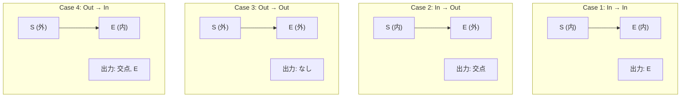

## 凸多角形の切断とは

凸多角形を直線で切断し、直線の片側にある部分を求める操作である。半平面交差や計算幾何の多くの問題で基本操作として用いられる。

凸多角形を直線で切断すると、結果も凸多角形になる (凸集合と半平面の交差は凸集合)。この性質により、複数回の切断を逐次的に適用できる。

## Sutherland-Hodgman アルゴリズム

### アイデア

凸多角形の各辺について、切断線に対する始点と終点の位置関係を調べ、結果の頂点列を構築する。

このアルゴリズムは元々、矩形領域によるクリッピング (矩形の 4 辺で順に切断) のために設計されたものだが、一般の直線による切断にも適用できる。

### 矩形クリッピングの手順

矩形クリッピングでは、4 本の辺 (左・右・上・下) でそれぞれ切断を行う。各辺での切断は独立であり、前の辺での結果を次の辺への入力とする。


### 4つのケース

辺の始点を $S$、終点を $E$ とする。各辺について、切断線に対する位置関係で 4 つのケースに分類する:

1. **$S$ が内側、$E$ が内側**: $E$ を出力に追加
2. **$S$ が内側、$E$ が外側**: $S$ と $E$ の交点を出力に追加
3. **$S$ が外側、$E$ が外側**: 何も追加しない
4. **$S$ が外側、$E$ が内側**: 交点と $E$ を出力に追加



**注意:** Case 1 で $S$ を出力に追加しないのは、$S$ は前の辺の処理で既に出力されている (または最初の頂点として処理される) ためである。

### 内側/外側の判定

直線を通る2点 $P_1, P_2$ に対して、点 $Q$ の位置は外積で判定する:

$$
\text{cross}(P_1, P_2, Q) = (P_2 - P_1) \times (Q - P_1)
$$

- 値が正 (または 0): 左側 (内側)
- 値が負: 右側 (外側)

具体的には:

$$
\text{cross}(P_1, P_2, Q) = (P_{2x} - P_{1x})(Q_y - P_{1y}) - (P_{2y} - P_{1y})(Q_x - P_{1x})
$$

### 交点の計算

辺 $SE$ と切断線 $P_1P_2$ の交点は、パラメータ $t$ を用いて:

$$
t = \frac{d_S}{d_S - d_E}, \quad \text{intersection} = S + t(E - S)
$$

ここで $d_S = \text{cross}(P_1, P_2, S)$, $d_E = \text{cross}(P_1, P_2, E)$ である。

$d_S$ と $d_E$ は符号が異なる ($S$ と $E$ が直線の反対側にある) ため、$d_S - d_E \neq 0$ が保証される。$t$ は $[0, 1]$ の範囲に収まり、交点が辺 $SE$ 上にあることを表す。

### 実装

```python title="polygon_clipping.py"
def cross(o, a, b):
    """Compute cross product (a-o) x (b-o)."""
    return (a[0] - o[0]) * (b[1] - o[1]) - (a[1] - o[1]) * (b[0] - o[0])

def line_intersect(p1, p2, p3, p4):
    """Compute intersection of segment p1-p2 with line p3-p4."""
    d1 = cross(p3, p4, p1)
    d2 = cross(p3, p4, p2)
    t = d1 / (d1 - d2)
    return (p1[0] + t * (p2[0] - p1[0]),
            p1[1] + t * (p2[1] - p1[1]))

def clip_polygon(polygon, line_p1, line_p2):
    """Clip polygon by the half-plane to the left of line_p1 -> line_p2."""
    result = []
    n = len(polygon)
    for i in range(n):
        cur = polygon[i]
        nxt = polygon[(i + 1) % n]
        cur_side = cross(line_p1, line_p2, cur)
        nxt_side = cross(line_p1, line_p2, nxt)

        if cur_side >= 0:
            result.append(cur)       # cur is inside
        if (cur_side >= 0) != (nxt_side >= 0):
            result.append(line_intersect(cur, nxt, line_p1, line_p2))

    return result
```

この実装では 4 つのケースを 2 つの条件で簡潔に表現している:

- `cur_side >= 0` → $S$ が内側なら $S$ を出力 (Case 1, 2)
- `(cur_side >= 0) != (nxt_side >= 0)` → $S$ と $E$ が異なる側なら交点を出力 (Case 2, 4)

## 具体的な数値例

正方形 $(0,0), (6,0), (6,6), (0,6)$ を直線 $x + y = 8$ (通過点 $(8,0)$ と $(0,8)$) で切断する。この直線の左側 (原点側) を残す。

切断線の方向ベクトルを $(8,0) \to (0,8)$ とする。

**頂点ごとの位置判定:**

| 頂点 | 座標 | $d = \text{cross}((8,0), (0,8), Q)$ | 位置 |
|------|------|------|------|
| $A$ | $(0,0)$ | $(0-8)(0-0) - (8-0)(0-8) = 0 + 64 = 64$ | 内側 |
| $B$ | $(6,0)$ | $(0-8)(0-0) - (8-0)(6-8) = 0 + 16 = 16$ | 内側 |
| $C$ | $(6,6)$ | $(0-8)(6-0) - (8-0)(6-8) = -48 + 16 = -32$ | 外側 |
| $D$ | $(0,6)$ | $(0-8)(6-0) - (8-0)(0-8) = -48 + 64 = 16$ | 内側 |

**辺ごとの処理:**

| 辺 | $S$ | $E$ | ケース | 出力 |
|----|-----|-----|--------|------|
| $AB$ | $A$ (内) | $B$ (内) | Case 1 | $A$ |
| $BC$ | $B$ (内) | $C$ (外) | Case 2 | $B$, 交点 $I_1$ |
| $CD$ | $C$ (外) | $D$ (内) | Case 4 | 交点 $I_2$, $D$ |
| $DA$ | $D$ (内) | $A$ (内) | Case 1 | $D$ (重複を除く) |

**交点の計算:**

$I_1$ (辺 $BC$ と直線の交点): $d_B = 16$, $d_C = -32$, $t = 16/(16+32) = 1/3$

$$I_1 = B + \frac{1}{3}(C - B) = (6, 0) + \frac{1}{3}(0, 6) = (6, 2)$$

$I_2$ (辺 $CD$ と直線の交点): $d_C = -32$, $d_D = 16$, $t = -32/(-32-16) = 2/3$

$$I_2 = C + \frac{2}{3}(D - C) = (6, 6) + \frac{2}{3}(-6, 0) = (2, 6)$$

**結果:** $(0,0), (6,0), (6,2), (2,6), (0,6)$ の五角形。

## 凸多角形同士のクリッピング

凸多角形 $P$ を別の凸多角形 $Q$ でクリッピングする (交差部分を求める) には、$Q$ の各辺で順に $P$ を切断すればよい。$Q$ が $m$ 頂点なら $m$ 回の切断を行う。

```python title="convex_clip.py"
def clip_by_convex(subject, clip):
    """Clip subject polygon by convex clip polygon."""
    result = subject[:]
    m = len(clip)
    for i in range(m):
        if len(result) == 0:
            break
        p1 = clip[i]
        p2 = clip[(i + 1) % m]
        result = clip_polygon(result, p1, p2)
    return result
```

凸多角形同士の交差は凸多角形になるため、各ステップの入力も凸多角形であり、Sutherland-Hodgman アルゴリズムが正しく動作する。

## Weiler-Atherton アルゴリズム

Sutherland-Hodgman は凸クリッピング領域に対してのみ正しく動作する。凹多角形同士のクリッピング (交差・和・差) を扱うには **Weiler-Atherton アルゴリズム** が必要である。

Weiler-Atherton の基本的なアイデア:

1. 2 つの多角形の辺の交点をすべて求める
2. 各多角形の頂点列に交点を挿入する
3. 交点を通じて 2 つの多角形を行き来しながら、結果の多角形を構築する

Weiler-Atherton は汎用的だが、実装が複雑で数値的に不安定になりやすい。凸多角形のクリッピングには Sutherland-Hodgman で十分である。

## 計算量

1回の切断は $O(n)$ で行える ($n$ は多角形の頂点数)。

$k$ 本の直線で切断する場合、逐次切断は $O(nk)$ だが、各切断で頂点数は最大1増えるため最終的な頂点数は $O(n + k)$ である。

凸多角形 ($m$ 頂点) によるクリッピングは $O(nm)$ である。

## 数値的な注意点

- 浮動小数点演算による誤差の蓄積に注意が必要。特に交点計算で $d_S - d_E$ が 0 に近い場合、交点の座標が大きく振れることがある
- 頂点が切断線上にちょうど乗る場合 ($d = 0$) の処理を正しく行う。上の実装では $d \geq 0$ を内側としている
- 多数回の切断を繰り返すと頂点数が増えていくため、不要な頂点 (一直線上に並ぶ 3 点の中間点) を除去するクリーンアップが有効な場合がある

## 応用

- 半平面交差 (逐次切断法)
- 可視領域の計算
- シャドウボリュームの切断
- コンピュータグラフィックスのクリッピング
- ボロノイ図の構築 (各サイトの領域を半平面で切断)

## まとめ

| 項目 | 内容 |
|------|------|
| 入力 | 凸多角形と切断線 |
| 出力 | 切断後の凸多角形 |
| 時間計算量 | $O(n)$ per cut |
| 核心 | 辺ごとの内側/外側判定と交点計算 |
| 凸多角形クリッピング | $O(nm)$ ($m$ は切断多角形の頂点数) |
| 制限 | 凸クリッピング領域のみ (凹は Weiler-Atherton) |
