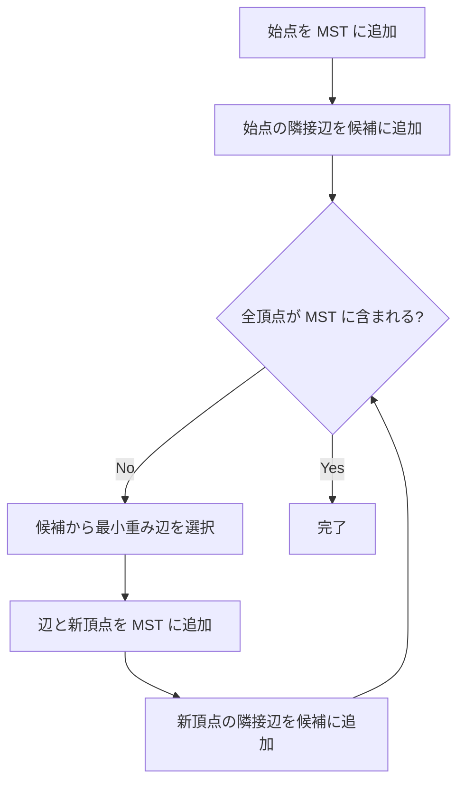

## Prim法とは

Prim法は、重み付き無向連結グラフの**最小全域木 (Minimum Spanning Tree, MST)** を求める貪欲アルゴリズムである。1つの頂点から始めて、MST に隣接する辺のうち最小重みのものを繰り返し追加していく。

Kruskal法が辺ベースであるのに対し、Prim法は頂点ベースのアプローチを取る。

## アルゴリズムの流れ

1. 任意の頂点を MST の初期頂点とする
2. MST に含まれる頂点集合 $S$ から出て、$S$ に含まれない頂点に向かう辺の中で最小重みの辺を選ぶ
3. その辺と新しい頂点を MST に追加する
4. 全頂点が MST に含まれるまで繰り返す



## 実装

### 優先度付きキューを使った実装

```python title="prim.py"
import heapq

def prim(n: int, adj: list[list[tuple[int, int]]]) -> list[tuple[int, int, int]]:
    """
    n: number of vertices
    adj[u]: list of (v, weight) for each neighbor
    returns: list of MST edges (u, v, weight)
    """
    in_mst = [False] * n
    mst_edges = []
    # (weight, from_vertex, to_vertex)
    heap = [(0, -1, 0)]

    while heap and len(mst_edges) < n - 1:
        w, frm, to = heapq.heappop(heap)
        if in_mst[to]:
            continue
        in_mst[to] = True
        if frm != -1:
            mst_edges.append((frm, to, w))
        for nxt, nw in adj[to]:
            if not in_mst[nxt]:
                heapq.heappush(heap, (nw, to, nxt))

    return mst_edges
```

## 正当性の証明

### 命題: Prim法は最小全域木を出力する

**証明 (カットの性質を利用):**

Prim法の各ステップで追加される辺は、MST の頂点集合 $S$ と $V \setminus S$ のカットを横断する最小重み辺である。

カットの性質 (Cut Property) より、任意のカットを横断する最小重み辺は、ある最小全域木に含まれる。

帰納法で示す。$k$ ステップ後に追加された辺集合 $T_k$ がある MST $T^*$ の部分集合であると仮定する。$k + 1$ ステップ目に追加する辺 $e$ がカットの最小重み辺であるから、もし $e \notin T^*$ であっても、$T^*$ に $e$ を加えて生じる閉路から $e$ 以外の辺を1本削除すれば、重みが $T^*$ 以下の全域木が得られる。$T^*$ の最小性より、これも MST であり、$T_{k+1}$ はこの MST の部分集合となる。 $\square$

## 計算量

### 二分ヒープの場合

| 操作 | 計算量 |
|------|--------|
| Insert | $O(\log V)$ |
| Extract-Min | $O(\log V)$ |
| 全体 | $O(E \log V)$ |

### フィボナッチヒープの場合

| 操作 | 計算量 |
|------|--------|
| Insert | $O(1)$ 償却 |
| Decrease-Key | $O(1)$ 償却 |
| Extract-Min | $O(\log V)$ 償却 |
| 全体 | $O(E + V \log V)$ |

密グラフ ($E = \Theta(V^2)$) では、フィボナッチヒープを使った Prim法が $O(V^2)$ で最適となる。

## Kruskal法との比較

Prim法は密グラフで有利であり、Kruskal法は疎グラフで有利である。

- **Prim法**: 頂点から成長させるので、隣接リスト表現で効率的
- **Kruskal法**: 辺をソートするので、辺リスト表現で自然

## まとめ

| 項目 | 内容 |
|------|------|
| 入力 | 重み付き無向連結グラフ |
| 出力 | 最小全域木 |
| 時間計算量 | $O(E \log V)$ (二分ヒープ) |
| 空間計算量 | $O(V + E)$ |
| 核心 | カットを横断する最小重み辺の選択 |
| 応用 | ネットワーク設計、近似アルゴリズム |
