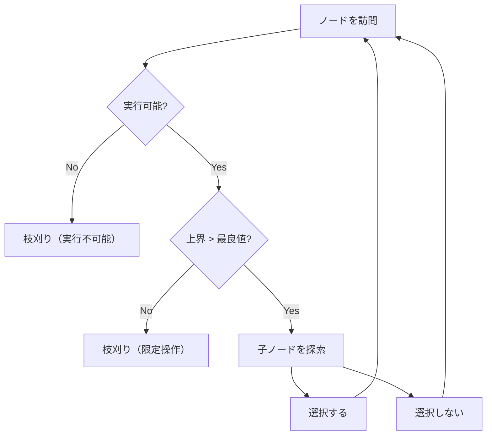

## 枝刈り全探索とは

枝刈り全探索 (Pruning Search / Branch and Bound) は、全探索 (バックトラッキング) の過程で**解にならないことが明らかな分岐を早期に打ち切る** (枝刈りする) ことで、探索空間を大幅に削減する手法である。

### 全探索の限界

$n$ 個の要素に対する部分集合の全探索は $O(2^n)$、順列の全探索は $O(n!)$ の計算量がかかる。$n$ がある程度大きいと現実的な時間で解けない。

枝刈りは、探索木のノードを訪問する前に「このノード以下に解が存在し得るか」を判定し、存在し得ない場合はそのノード以下を丸ごとスキップする。

## 枝刈りの分類

### 1. 実行可能性による枝刈り (Feasibility Pruning)

制約を満たさないことが確定した時点で打ち切る。

例: ナップサック問題で、現在の重さが容量を超えたら、それ以上アイテムを追加しても解にならない。

### 2. 限定操作による枝刈り (Bounding / Branch and Bound)

現在の状態から到達可能な最良の解が、既知の最良解を超えないなら打ち切る。

例: ナップサック問題で、残りのアイテムを緩和問題 (分数ナップサック) で上界を求め、それが現在の最良値以下なら枝刈り。

### 3. 対称性による枝刈り (Symmetry Breaking)

対称な解を重複して探索しないようにする。

例: N-Queens 問題で、盤面の回転・反転を考慮して探索空間を縮小。

## 典型例: 0/1 ナップサック問題

### 問題

$n$ 個のアイテムがあり、アイテム $i$ の重さは $w_i$、価値は $v_i$ である。容量 $W$ のナップサックに入れるアイテムの価値の和を最大化せよ。

### 枝刈り付き全探索

```python title="knapsack_branch_bound.py"
def knapsack_bb(items: list[tuple[int, int]], capacity: int) -> int:
    n = len(items)
    # Sort by value/weight ratio descending
    sorted_items = sorted(items, key=lambda x: x[1] / x[0], reverse=True)
    best = 0

    def upper_bound(idx: int, cur_weight: int, cur_value: int) -> float:
        """Fractional knapsack upper bound"""
        bound = cur_value
        w = cur_weight
        for i in range(idx, n):
            wi, vi = sorted_items[i]
            if w + wi <= capacity:
                w += wi
                bound += vi
            else:
                bound += (capacity - w) / wi * vi
                break
        return bound

    def dfs(idx: int, cur_weight: int, cur_value: int) -> None:
        nonlocal best
        if idx == n:
            best = max(best, cur_value)
            return

        # Pruning: upper bound check
        if upper_bound(idx, cur_weight, cur_value) <= best:
            return

        # Try including item
        wi, vi = sorted_items[idx]
        if cur_weight + wi <= capacity:
            dfs(idx + 1, cur_weight + wi, cur_value + vi)

        # Try excluding item
        dfs(idx + 1, cur_weight, cur_value)

    dfs(0, 0, 0)
    return best
```

### 枝刈りの効果



ソートと上界の計算により、実際に探索するノード数は全探索の $2^n$ から大幅に減少する。最悪ケースでは改善されないが、典型的な入力では劇的に高速になる。

## 他の応用例

### N-Queens 問題

$n \times n$ のチェス盤に $n$ 個のクイーンを互いに攻撃しないように配置する問題。

枝刈り:
- 行ごとに配置を決める (行の重複排除)
- 列が使用済みなら枝刈り
- 対角線が使用済みなら枝刈り

```python title="n_queens.py"
def n_queens(n: int) -> int:
    count = 0
    cols = set()
    diag1 = set()  # row - col
    diag2 = set()  # row + col

    def dfs(row: int) -> None:
        nonlocal count
        if row == n:
            count += 1
            return
        for col in range(n):
            if col in cols or (row - col) in diag1 or (row + col) in diag2:
                continue  # pruning
            cols.add(col)
            diag1.add(row - col)
            diag2.add(row + col)
            dfs(row + 1)
            cols.remove(col)
            diag1.remove(row - col)
            diag2.remove(row + col)

    dfs(0)
    return count
```

### 巡回セールスマン問題 (TSP)

最短経路の下界 (例: 最小全域木の重み) を計算し、既知の最短経路以上になったら枝刈り。

## 枝刈りの設計原則

1. **強い上界 (下界) を使う**: 上界が厳密であるほど枝刈りの効果が高い
2. **良い解を先に見つける**: 探索順を工夫して早期に良い解を見つけると、以降の枝刈りが効く
3. **前処理でソートする**: 価値/重さ比などでソートすると上界の計算精度が上がる
4. **計算コストとのバランス**: 上界の計算自体にコストがかかりすぎると逆効果

## 計算量

枝刈り全探索の計算量は入力に強く依存し、一般的な上界を示すのは難しい。

| ケース | 計算量 |
|--------|--------|
| 最悪ケース | 全探索と同じ ($O(2^n)$ や $O(n!)$) |
| 平均ケース | 入力に依存 |
| 最良ケース | 多項式時間 |

実用上は、良い上界と探索順の工夫により、全探索に比べて数桁の高速化が得られることが多い。

## まとめ

| 項目 | 内容 |
|------|------|
| 手法 | バックトラッキング + 枝刈り |
| 枝刈りの種類 | 実行可能性、限定操作、対称性 |
| 最悪計算量 | 全探索と同じ |
| 実用的効果 | 通常は劇的な高速化 |
| 設計のポイント | 強い上界、良い初期解、適切なソート |
| 典型問題 | ナップサック、N-Queens、TSP |
