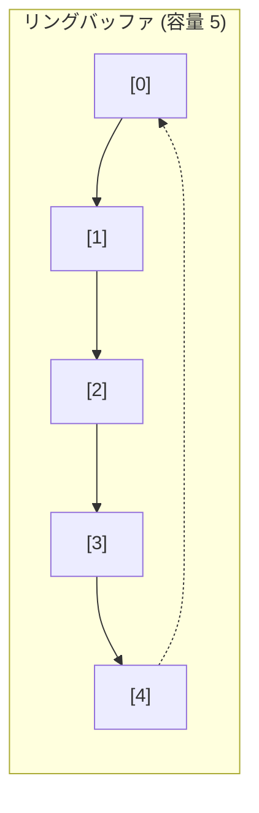

## Queue とは

Queue (キュー) は **FIFO (First In, First Out: 先入れ先出し)** の原則に基づくデータ構造である。最初に追加された要素が最初に取り出される。

日常的な例として、レジの行列を想像するとわかりやすい。先に並んだ人が先にサービスを受ける。

### 基本操作

| 操作 | 説明 | 時間計算量 |
|------|------|------------|
| `enqueue(x)` | 要素 $x$ をキューの末尾に追加 | $O(1)$ |
| `dequeue()` | キューの先頭から要素を取り出す | $O(1)$ |
| `peek()` / `front()` | 先頭の要素を取り出さずに参照 | $O(1)$ |
| `isEmpty()` | キューが空かどうかを返す | $O(1)$ |
| `size()` | キュー内の要素数を返す | $O(1)$ |

## 配列による実装 (リングバッファ)

単純な配列で実装すると、dequeue のたびに全要素をシフトする必要があり $O(n)$ かかる。これを回避するために**リングバッファ (Circular Buffer)** を使う。

リングバッファでは、配列の末尾に達したら先頭に戻って使い回す。先頭位置 `head` と末尾位置 `tail` の 2 つのポインタを管理する。

```python title="queue_ring.py"
class Queue:
    def __init__(self, capacity: int):
        self.data = [None] * capacity
        self.head = 0
        self.tail = 0
        self.count = 0
        self.capacity = capacity

    def enqueue(self, x):
        if self.count == self.capacity:
            raise OverflowError("Queue overflow")
        self.data[self.tail] = x
        self.tail = (self.tail + 1) % self.capacity
        self.count += 1

    def dequeue(self):
        if self.count == 0:
            raise IndexError("Queue underflow")
        val = self.data[self.head]
        self.head = (self.head + 1) % self.capacity
        self.count -= 1
        return val

    def peek(self):
        if self.count == 0:
            raise IndexError("Queue is empty")
        return self.data[self.head]

    def is_empty(self) -> bool:
        return self.count == 0

    def size(self) -> int:
        return self.count
```

### リングバッファの図解



`head` と `tail` が配列の末尾に達すると先頭に戻る。これにより、配列の中間にある「穴」を効率的に再利用できる。

## 連結リストによる実装

```python title="queue_linked.py"
class Node:
    def __init__(self, val, next_node=None):
        self.val = val
        self.next = next_node

class LinkedQueue:
    def __init__(self):
        self.head = None
        self.tail = None
        self._size = 0

    def enqueue(self, x):
        node = Node(x)
        if self.tail is None:
            self.head = self.tail = node
        else:
            self.tail.next = node
            self.tail = node
        self._size += 1

    def dequeue(self):
        if self.head is None:
            raise IndexError("Queue underflow")
        val = self.head.val
        self.head = self.head.next
        if self.head is None:
            self.tail = None
        self._size -= 1
        return val

    def peek(self):
        if self.head is None:
            raise IndexError("Queue is empty")
        return self.head.val

    def is_empty(self) -> bool:
        return self.head is None

    def size(self) -> int:
        return self._size
```

## 計算量

| 実装方法 | enqueue | dequeue | peek | 空間計算量 |
|----------|---------|---------|------|------------|
| リングバッファ | $O(1)$ | $O(1)$ | $O(1)$ | $O(n)$ |
| 連結リスト | $O(1)$ | $O(1)$ | $O(1)$ | $O(n)$ |
| 単純配列 | $O(1)$ | $O(n)$ | $O(1)$ | $O(n)$ |

リングバッファ方式が最も効率的かつメモリ使用量が少ない。

## 応用

### 幅優先探索 (BFS)

キューはグラフの幅優先探索に不可欠である。探索の開始頂点をキューに入れ、隣接する未訪問の頂点をキューに追加し、キューが空になるまで繰り返す。

### タスクスケジューリング

OS のプロセススケジューラや Web サーバーのリクエスト処理では、FIFO キューが広く使われている。

### メッセージキュー

分散システムにおけるメッセージの非同期処理に Queue が利用される (例: RabbitMQ, Amazon SQS)。

## まとめ

| 項目 | 内容 |
|------|------|
| データ構造 | Queue (キュー) |
| 原則 | FIFO (First In, First Out) |
| 基本操作 | enqueue, dequeue, peek |
| 時間計算量 | 全操作 $O(1)$ (リングバッファ) |
| 空間計算量 | $O(n)$ |
| 主な応用 | BFS、タスクスケジューリング、メッセージキュー |
