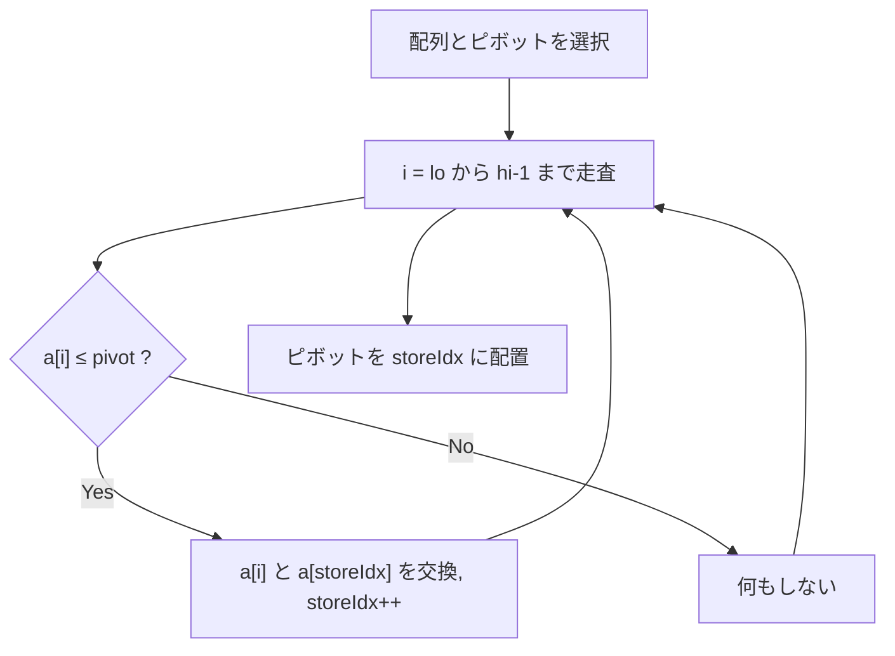

## Quick Sort とは

Quick Sort (クイックソート) は、ピボットと呼ばれる基準値を用いて配列を分割し、再帰的にソートする分割統治法に基づくアルゴリズムである。平均計算量 $O(n \log n)$ で、実用上最も高速なソートアルゴリズムの 1 つとして広く用いられている。

## アルゴリズムの概要

### 手順

1. **ピボット選択:** 配列から 1 つの要素をピボットとして選ぶ
2. **パーティション:** ピボット以下の要素を左側、ピボットより大きい要素を右側に分割する
3. **再帰:** 左右の部分配列を再帰的にソートする

### Lomuto パーティション

本記事では Lomuto パーティションスキームを用いる。最後の要素をピボットとし、配列を走査してピボット以下の要素を左側に集める。



## 実装

```python title="quick_sort.py"
def quick_sort(a: list[int], lo: int = 0, hi: int = -1) -> list[int]:
    if hi == -1:
        hi = len(a) - 1
    if lo < hi:
        pivot_idx = partition(a, lo, hi)
        quick_sort(a, lo, pivot_idx - 1)
        quick_sort(a, pivot_idx + 1, hi)
    return a

def partition(a: list[int], lo: int, hi: int) -> int:
    pivot = a[hi]
    store_idx = lo
    for j in range(lo, hi):
        if a[j] <= pivot:
            a[store_idx], a[j] = a[j], a[store_idx]
            store_idx += 1
    a[store_idx], a[hi] = a[hi], a[store_idx]
    return store_idx
```

## 計算量

| ケース | 時間計算量 | 説明 |
|--------|-----------|------|
| 最良 | $O(n \log n)$ | ピボットが常に中央値 |
| 平均 | $O(n \log n)$ | ランダムな入力 |
| 最悪 | $O(n^2)$ | ピボットが常に最小 or 最大値 |

**空間計算量:** $O(\log n)$ (再帰のコールスタック、平均ケース)

### 最悪ケースの分析

ピボットが常に最小または最大要素の場合、パーティションにより 0 個と $n-1$ 個に分割される。漸化式は:

$$
T(n) = T(n-1) + O(n) = O(n^2)
$$

### 平均ケースの分析

ピボットがランダムに選ばれる場合、期待される分割比は均等に近い。平均計算量の漸化式は:

$$
T(n) = \frac{1}{n} \sum_{i=0}^{n-1} \left[ T(i) + T(n-1-i) \right] + O(n)
$$

この漸化式の解は $T(n) = O(n \log n)$ である。

## ピボット選択戦略

最悪ケースを回避するためのピボット選択戦略がいくつかある:

1. **ランダム選択:** 配列からランダムに要素を選ぶ。期待計算量は $O(n \log n)$
2. **三要素の中央値 (Median-of-Three):** 先頭・中央・末尾の 3 要素の中央値を選ぶ
3. **Median of Medians:** $O(n)$ で真の中央値を求められるが、定数因子が大きい

## 安定性

Quick Sort は**不安定ソート**である。パーティション操作で等しい要素の相対順序が変わる可能性がある。

## Hoare パーティション

Lomuto パーティションの代わりに Hoare パーティションを使うこともできる。Hoare パーティションは平均して交換回数が少なく、実用上高速である。

```python title="hoare_partition.py"
def hoare_partition(a: list[int], lo: int, hi: int) -> int:
    pivot = a[lo]
    i = lo - 1
    j = hi + 1
    while True:
        i += 1
        while a[i] < pivot:
            i += 1
        j -= 1
        while a[j] > pivot:
            j -= 1
        if i >= j:
            return j
        a[i], a[j] = a[j], a[i]
```

## 特徴と応用

### 長所

- 平均計算量 $O(n \log n)$ で実用上最も高速
- in-place (追加メモリ $O(\log n)$)
- キャッシュ効率が良い

### 短所

- 最悪計算量 $O(n^2)$
- 不安定ソート
- 再帰のオーバーヘッド

### 応用場面

- 汎用ソート (C言語の qsort, Java の Arrays.sort(int[]) 等)
- Intro Sort のベースアルゴリズム
- $k$ 番目に小さい要素の選択 (Quick Select)

## まとめ

| 項目 | 内容 |
|------|------|
| 時間計算量 (最良/平均/最悪) | $O(n \log n)$ / $O(n \log n)$ / $O(n^2)$ |
| 空間計算量 | $O(\log n)$ |
| 安定性 | 不安定 |
| in-place | はい |
| 手法 | 分割統治法 (ピボットによるパーティション) |
