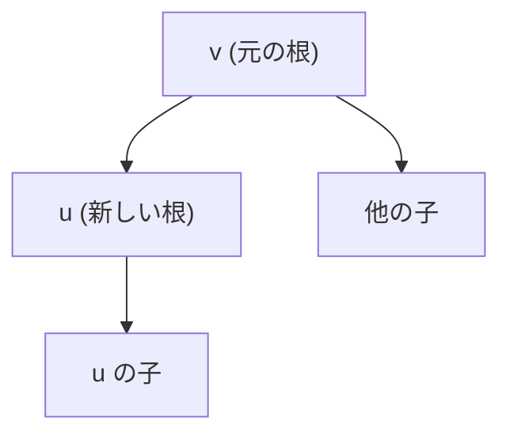

## 全方位木DP とは

全方位木DP (Rerooting DP) は、木の各頂点を根としたときのDP値を、全頂点について $O(n)$ で求めるテクニックである。素朴に各頂点を根として木DPを行うと $O(n^2)$ かかるが、根の移動による差分更新を利用して線形時間に抑える。

### 典型的な問題

$n$ 頂点の木が与えられたとき、各頂点 $v$ を根としたときの以下のような値を全頂点について求めよ:

- 最遠頂点までの距離
- 部分木のサイズの二乗和
- 部分木に含まれる頂点の重みの合計

## アルゴリズムの概要

全方位木DPは2回のDFSで構成される。

### DFS1: ボトムアップ

任意の頂点 (通常は頂点0) を根として木DPを行い、$dp[v]$ (頂点 $v$ の部分木に関する値) を計算する。

### DFS2: トップダウン (Rerooting)

根を親から子に移動させながら、各頂点の答え $ans[v]$ を計算する。根を移動するとき、「元の根から見た子の寄与」を取り除き、「新しい根から見た親の寄与」を加える。

### 核心: 根の移動

頂点 $v$ の子 $u$ に根を移すとき:

1. $v$ の値から $u$ の寄与を除く
2. その値を $u$ の「親からの寄与」として加える



## 形式的な定式化

木の各辺に対する寄与関数を $f$、集約関数を $g$ (結合的で単位元を持つ) とする。

DFS1 (ボトムアップ):
$$
dp[v] = g(f(dp[c_1]), f(dp[c_2]), \ldots, f(dp[c_k]))
$$

ここで $c_1, \ldots, c_k$ は $v$ の子。

DFS2 (根の移動): 頂点 $v$ から子 $u$ に根を移すとき、

$$
ans[u] = g(dp[u],\, f(\text{(ans[v] から u の寄与を除いたもの)}))
$$

### 効率的な寄与の除去: 累積演算

子が複数ある場合に「$u$ の寄与を除いた値」を効率的に求めるため、子の値の**前方累積**と**後方累積**を用いる。

$v$ の子を $c_1, c_2, \ldots, c_k$ とし、各子の寄与を $h_i = f(dp[c_i])$ とする。

$$
\text{prefix}[i] = g(h_1, h_2, \ldots, h_i)
$$
$$
\text{suffix}[i] = g(h_i, h_{i+1}, \ldots, h_k)
$$

$c_i$ の寄与を除いた値は $g(\text{prefix}[i-1], \text{suffix}[i+1])$。

## 具体例: 最遠頂点距離

各頂点 $v$ から最も遠い頂点までの距離を求める。

- $f(x) = x + 1$ (辺の重み1を加算)
- $g = \max$ (最大値を取る)
- 単位元: $0$

```python title="rerooting_dp.py"
def rerooting_dp(n: int, edges: list[tuple[int, int]]) -> list[int]:
    adj = [[] for _ in range(n)]
    for u, v in edges:
        adj[u].append(v)
        adj[v].append(u)

    # DFS1: bottom-up
    dp = [0] * n
    parent = [-1] * n
    order = []
    visited = [False] * n
    stack = [0]
    visited[0] = True
    while stack:
        v = stack.pop()
        order.append(v)
        for u in adj[v]:
            if not visited[u]:
                visited[u] = True
                parent[u] = v
                stack.append(u)
    for v in reversed(order):
        for u in adj[v]:
            if u != parent[v]:
                dp[v] = max(dp[v], dp[u] + 1)

    # DFS2: rerooting
    ans = [0] * n
    ans[0] = dp[0]
    for v in order:
        children = [u for u in adj[v] if u != parent[v]]
        child_vals = [dp[u] + 1 for u in children]
        k = len(children)
        prefix = [0] * (k + 1)
        suffix = [0] * (k + 1)
        for i in range(k):
            prefix[i + 1] = max(prefix[i], child_vals[i])
        for i in range(k - 1, -1, -1):
            suffix[i] = max(suffix[i + 1], child_vals[i])
        for ci, u in enumerate(children):
            from_v = 1 + max(prefix[ci], suffix[ci + 1],
                             ans[v] if ans[v] > dp[v] else 0)
            ans[u] = max(dp[u], from_v)
    return ans
```

## 計算量

| 項目 | 値 |
|------|------|
| 時間計算量 | $O(n)$ |
| 空間計算量 | $O(n)$ |

素朴に全頂点で木DPを行う $O(n^2)$ から大幅に改善される。

## 適用条件

全方位木DPが使えるのは、集約関数 $g$ が以下を満たす場合:

1. **結合的**: $g(g(a, b), c) = g(a, g(b, c))$
2. **単位元の存在**: $g(a, e) = a$
3. **特定の子の寄与を除去可能**: 前方・後方累積で実現

$g$ が可換 (交換法則を満たす) であれば、累積の代わりに「全体の値から1つの寄与を引く」ことも可能 ($g$ が逆元を持つ場合)。

## 応用

- 各頂点からの最遠距離 (木の直径の一般化)
- 部分木サイズの集約
- 木上の期待値計算
- 重心分解の前処理

## まとめ

| 項目 | 内容 |
|------|------|
| 入力 | $n$ 頂点の木 |
| 出力 | 各頂点を根としたDP値 |
| 時間計算量 | $O(n)$ |
| 空間計算量 | $O(n)$ |
| 核心 | 2回のDFSと前方・後方累積による根の差分更新 |
