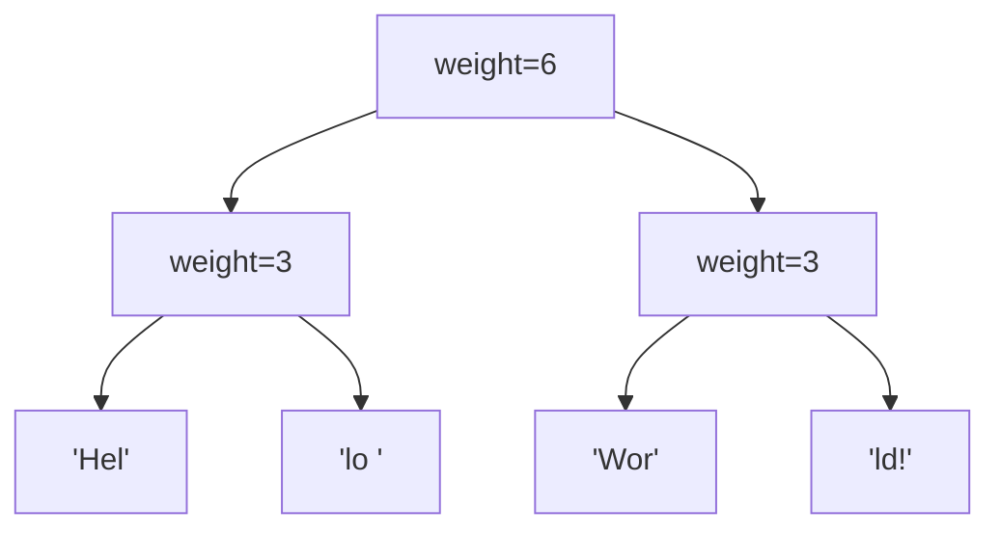

## Rope とは

Rope (ロープ) は、長い文字列を効率的に操作するための平衡二分木ベースのデータ構造である。1995年に Hans-J. Boehm, Russ Atkinson, Michael Plass によって提案された。テキストエディタの内部表現として広く使われている。

### 動機

通常の配列による文字列表現では、挿入・削除が $O(n)$ かかる。Rope はこれを $O(\log n)$ に改善する。

| 操作 | 配列 | Rope |
|------|------|------|
| 連結 | $O(n)$ | $O(\log n)$ |
| 分割 | $O(n)$ | $O(\log n)$ |
| 挿入 | $O(n)$ | $O(\log n)$ |
| 削除 | $O(n)$ | $O(\log n)$ |
| インデックスアクセス | $O(1)$ | $O(\log n)$ |

## 構造

Rope は二分木であり、**葉ノード**に文字列の断片を格納し、**内部ノード**には左部分木に含まれる文字数 (weight) を保持する。



上の木は文字列 "Hello World!" を表現している。

### ノードの定義

```python title="rope_node.py"
class RopeNode:
    def __init__(self, text=None, left=None, right=None):
        if text is not None:
            # Leaf node
            self.text = text
            self.weight = len(text)
            self.left = None
            self.right = None
        else:
            # Internal node
            self.text = None
            self.left = left
            self.right = right
            self.weight = self._calc_weight(left)

    def _calc_weight(self, node):
        if node is None:
            return 0
        if node.text is not None:
            return len(node.text)
        return node.weight + self._calc_weight(node.right)
```

## 基本操作

### Concat (連結)

2 つの Rope を連結するには、新しい内部ノードを作り、左右に元の Rope を配置する。

```python title="concat.py"
def concat(r1, r2):
    if r1 is None:
        return r2
    if r2 is None:
        return r1
    return RopeNode(left=r1, right=r2)
```

**計算量:** $O(1)$ (ただし、バランスを保つための再平衡が必要な場合は $O(\log n)$)

### Index (文字アクセス)

位置 $i$ の文字を取得する:

```python title="index.py"
def index(node, i):
    if node.text is not None:
        return node.text[i]
    if i < node.weight:
        return index(node.left, i)
    else:
        return index(node.right, i - node.weight)
```

**計算量:** $O(\log n)$

### Split (分割)

位置 $i$ で Rope を 2 つに分割する:

```python title="split.py"
def split(node, i):
    if node is None:
        return None, None
    if node.text is not None:
        # Leaf node: split the text
        return RopeNode(text=node.text[:i]), RopeNode(text=node.text[i:])
    if i < node.weight:
        left, right = split(node.left, i)
        return left, concat(right, node.right)
    elif i > node.weight:
        left, right = split(node.right, i - node.weight)
        return concat(node.left, left), right
    else:
        return node.left, node.right
```

**計算量:** $O(\log n)$

### Insert (挿入)

位置 $i$ に文字列 $s$ を挿入する:

1. 位置 $i$ で Split して 2 つの Rope を得る
2. 新しい葉ノード (文字列 $s$) を作る
3. 左の Rope、新しいノード、右の Rope を Concat する

```python title="insert.py"
def insert(rope, i, s):
    left, right = split(rope, i)
    new_leaf = RopeNode(text=s)
    return concat(concat(left, new_leaf), right)
```

**計算量:** $O(\log n)$

### Delete (削除)

位置 $[i, j)$ の部分を削除する:

1. 位置 $i$ と $j$ で 2 回 Split する
2. 左の Rope と右の Rope を Concat する (中間部分を捨てる)

```python title="delete.py"
def delete(rope, i, j):
    left, rest = split(rope, i)
    _, right = split(rest, j - i)
    return concat(left, right)
```

**計算量:** $O(\log n)$

## 再平衡

Rope は操作を繰り返すと木が偏る可能性がある。定期的に再平衡 (rebalancing) を行うことで、操作の効率を維持する。

Boehm らの元の論文では、フィボナッチ数列に基づく条件で再平衡の必要性を判定する方法が提案されている。

## 応用

- **テキストエディタ:** Xi Editor, VSCode のテキストバッファ
- **バージョン管理:** 差分の効率的な管理
- **関数型プログラミング:** 不変文字列の実装
- **大規模テキスト処理:** ログファイルの操作

## まとめ

| 項目 | 内容 |
|------|------|
| データ構造 | 二分木 (葉に文字列断片) |
| 連結 | $O(\log n)$ |
| 分割 | $O(\log n)$ |
| 挿入・削除 | $O(\log n)$ |
| インデックスアクセス | $O(\log n)$ |
| 用途 | テキストエディタ、大規模文字列操作 |
