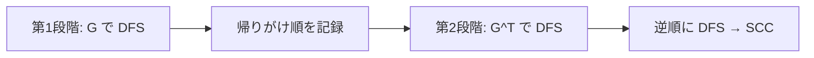

## Kosaraju のアルゴリズムとは

Kosaraju のアルゴリズムは、有向グラフの**強連結成分 (SCC)** を2回の DFS で求めるアルゴリズムである。Sharir-Kosaraju のアルゴリズムとも呼ばれる。

Tarjan のアルゴリズムと比べて概念的にシンプルで理解しやすい。

## アルゴリズムの流れ

### 第1段階: 帰りがけ順の取得

元のグラフ $G$ で DFS を行い、各頂点の DFS 完了時刻 (帰りがけ順) を記録する。

### 第2段階: 転置グラフでの DFS

グラフの全辺を逆向きにした**転置グラフ** $G^T$ を構築し、第1段階で得た帰りがけ順の逆順に DFS を行う。各 DFS で到達できた頂点集合が1つの SCC を構成する。



### 実装

```python title="scc_kosaraju.py"
def scc_kosaraju(n: int, edges: list[tuple[int, int]]) -> list[list[int]]:
    adj = [[] for _ in range(n)]
    radj = [[] for _ in range(n)]
    for u, v in edges:
        adj[u].append(v)
        radj[v].append(u)

    # Phase 1: DFS on original graph
    visited = [False] * n
    finish_order = []

    def dfs1(u: int):
        visited[u] = True
        for v in adj[u]:
            if not visited[v]:
                dfs1(v)
        finish_order.append(u)

    for i in range(n):
        if not visited[i]:
            dfs1(i)

    # Phase 2: DFS on reverse graph
    visited = [False] * n
    sccs = []

    def dfs2(u: int, scc: list[int]):
        visited[u] = True
        scc.append(u)
        for v in radj[u]:
            if not visited[v]:
                dfs2(v, scc)

    for u in reversed(finish_order):
        if not visited[u]:
            scc = []
            dfs2(u, scc)
            sccs.append(scc)

    return sccs
```

## 正当性の証明

### なぜ帰りがけ順の逆順が重要か

**補題:** SCC $C_1$ から $C_2$ への辺が存在するとき、第1段階の DFS で $C_1$ の最大完了時刻は $C_2$ の最大完了時刻より大きい。

**証明:** 2つのケースを考える。

1. $C_1$ が $C_2$ より先に発見された場合: $C_1$ の DFS 中に $C_2$ に到達し、$C_2$ の全頂点が先に完了する。したがって $C_1$ の最終完了時刻は $C_2$ より後。
2. $C_2$ が $C_1$ より先に発見された場合: $C_2$ の DFS は $C_1$ に到達しない ($C_2$ から $C_1$ への有向パスは存在しない、SCC が異なるので)。$C_2$ が完了した後に $C_1$ が発見されるので、$C_1$ の完了時刻の方が大きい。

**命題の証明:** 帰りがけ順の逆順で処理することで、SCC のトポロジカル順序で処理される。頂点 $u$ から転置グラフで DFS すると、$u$ の SCC に属する頂点のみに到達する。なぜなら、他の SCC への辺は転置グラフでは逆向きであり、かつトポロジカル順序の後のSCCはまだ未訪問のため到達できないからである。 $\square$

## 計算量

| 操作 | 計算量 |
|------|--------|
| 第1段階 DFS | $O(V + E)$ |
| 転置グラフ構築 | $O(V + E)$ |
| 第2段階 DFS | $O(V + E)$ |
| **合計** | $O(V + E)$ |

## Tarjan 法との比較

| 項目 | Kosaraju | Tarjan |
|------|----------|--------|
| DFS 回数 | 2 回 | 1 回 |
| 追加メモリ | 転置グラフ $O(V+E)$ | スタック + low/disc $O(V)$ |
| 実装難度 | 簡単 | やや複雑 |
| 定数倍 | やや遅い | 速い |

## まとめ

| 項目 | 内容 |
|------|------|
| 入力 | 有向グラフ |
| 出力 | 強連結成分のリスト |
| 時間計算量 | $O(V + E)$ |
| 空間計算量 | $O(V + E)$ |
| 核心 | 帰りがけ順の逆順 + 転置グラフでの DFS |
| 応用 | 2-SAT、DAG 圧縮 |
