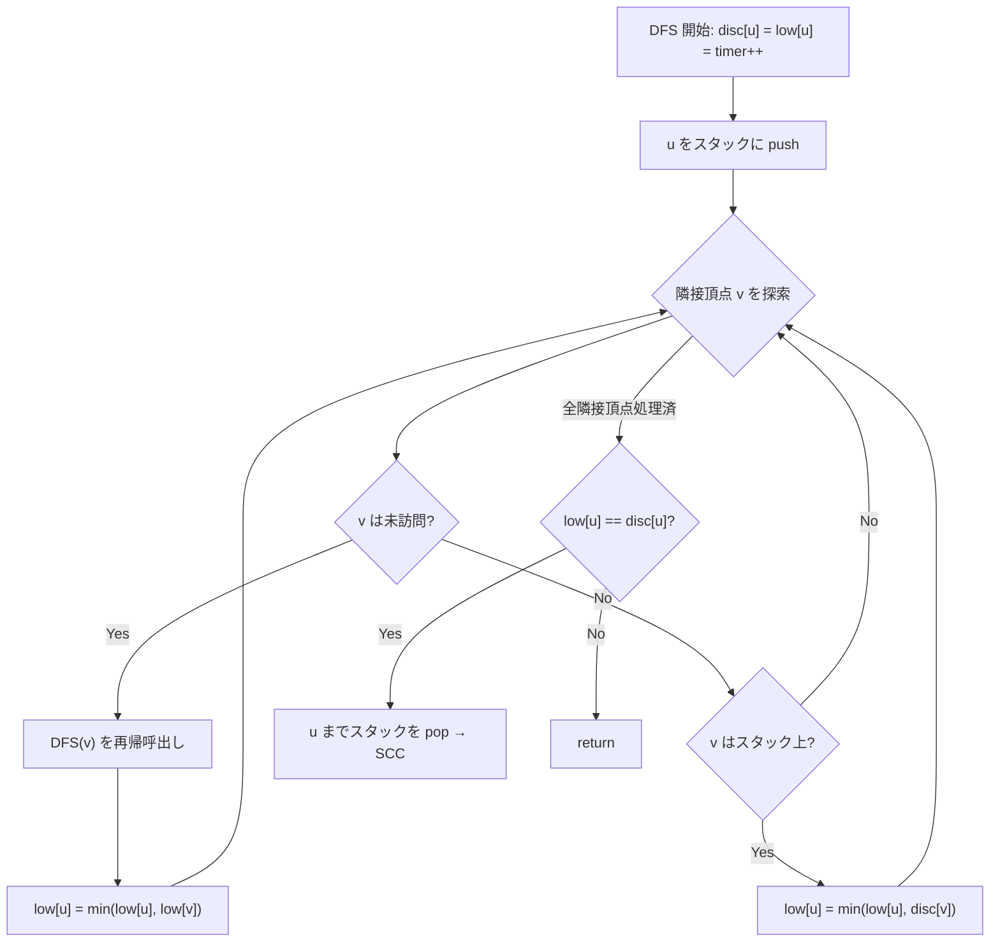

## 強連結成分とは

有向グラフ $G = (V, E)$ において、頂点集合 $S \subseteq V$ が**強連結 (strongly connected)** であるとは、$S$ の任意の2頂点 $u, v$ に対して $u$ から $v$ への有向パスと $v$ から $u$ への有向パスが共に存在することである。

**強連結成分 (SCC: Strongly Connected Component)** とは、極大な強連結部分集合である。

## Tarjan のアルゴリズム

Tarjan のアルゴリズムは、DFS を1回行うだけで全ての SCC を求める。各頂点に以下の2つの値を管理する:

- $\text{disc}[u]$: 頂点 $u$ の DFS 発見時刻
- $\text{low}[u]$: 頂点 $u$ から DFS 木の辺と後退辺をたどって到達できる頂点の最小発見時刻

### 核心アイデア

DFS 中にスタックを管理し、$\text{low}[u] = \text{disc}[u]$ となる頂点 $u$ を SCC の**根**とみなす。$u$ の DFS が終了したとき、スタックから $u$ まで pop した頂点集合が1つの SCC を構成する。

### アルゴリズムの流れ



### 実装

```python title="scc_tarjan.py"
def scc_tarjan(n: int, edges: list[tuple[int, int]]) -> list[list[int]]:
    adj = [[] for _ in range(n)]
    for u, v in edges:
        adj[u].append(v)

    disc = [-1] * n
    low = [-1] * n
    on_stack = [False] * n
    stack = []
    timer = [0]
    sccs = []

    def dfs(u: int):
        disc[u] = low[u] = timer[0]
        timer[0] += 1
        stack.append(u)
        on_stack[u] = True

        for v in adj[u]:
            if disc[v] == -1:
                dfs(v)
                low[u] = min(low[u], low[v])
            elif on_stack[v]:
                low[u] = min(low[u], disc[v])

        # Root of SCC
        if low[u] == disc[u]:
            scc = []
            while True:
                w = stack.pop()
                on_stack[w] = False
                scc.append(w)
                if w == u:
                    break
            sccs.append(scc)

    for i in range(n):
        if disc[i] == -1:
            dfs(i)

    return sccs
```

## 正当性の証明

### 命題: $\text{low}[u] = \text{disc}[u]$ のとき、$u$ は SCC の根である

**証明の概略:**

$\text{low}[u] = \text{disc}[u]$ は、$u$ の DFS 部分木内のどの頂点からも、$u$ より早く発見された (かつスタック上にある) 頂点に到達できないことを意味する。

スタック上で $u$ より上にある頂点は全て $u$ の DFS 部分木内にある。これらの頂点は $u$ から到達可能であり、かつ $u$ に戻るパスが存在する (後退辺やクロス辺を通じて)。したがって、$u$ からスタックの top までの頂点集合は強連結である。

逆に、この集合が極大であることは、$\text{low}[u] = \text{disc}[u]$ の条件から従う。 $\square$

## 計算量

| 操作 | 計算量 |
|------|--------|
| DFS | $O(V + E)$ |
| スタック操作 | $O(V)$ |
| **合計** | $O(V + E)$ |

## Kosaraju 法との比較

| 項目 | Tarjan | Kosaraju |
|------|--------|----------|
| DFS 回数 | 1 回 | 2 回 |
| 追加データ構造 | スタック + low/disc | 転置グラフ |
| 実装の複雑さ | やや複雑 | シンプル |

## 応用

- **2-SAT**: 含意グラフの SCC 分解で充足可能性を判定
- **DAG 圧縮**: SCC を1頂点に縮約して DAG を構成
- **到達可能性**: SCC 内の任意の2頂点間は互いに到達可能

## まとめ

| 項目 | 内容 |
|------|------|
| 入力 | 有向グラフ |
| 出力 | 強連結成分のリスト |
| 時間計算量 | $O(V + E)$ |
| 空間計算量 | $O(V)$ |
| 核心 | DFS + low-link 値 + スタック |
| 応用 | 2-SAT、DAG 圧縮 |
