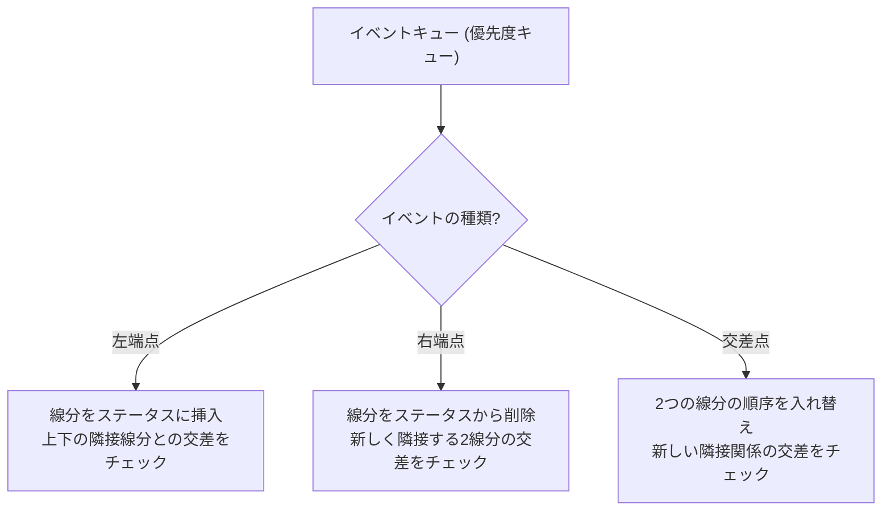

## 線分交差判定とは

2つの線分が交差するか (共有点を持つか) を判定する問題である。計算幾何の最も基本的な操作の一つであり、多くのアルゴリズムの構成要素となる。

## 外積を用いた判定法

### 外積 (Cross Product)

2次元ベクトル $\vec{u} = (u_x, u_y)$ と $\vec{v} = (v_x, v_y)$ の外積は以下で定義される。

$$
\vec{u} \times \vec{v} = u_x v_y - u_y v_x
$$

3点 $O, A, B$ に対する **方向 (orientation)** は以下で判定できる。

$$
d = (A - O) \times (B - O)
$$

- $d > 0$: $O \to A \to B$ が反時計回り (左折)
- $d < 0$: $O \to A \to B$ が時計回り (右折)
- $d = 0$: 3点が一直線上

### 判定アルゴリズム

線分 $AB$ と線分 $CD$ が交差するための条件:

1. $C$ と $D$ が直線 $AB$ の異なる側にある (= $AB$ が $CD$ を跨ぐ)
2. $A$ と $B$ が直線 $CD$ の異なる側にある (= $CD$ が $AB$ を跨ぐ)

外積の符号で表すと:

$$
d_1 = \text{cross}(A, B, C), \quad d_2 = \text{cross}(A, B, D)
$$
$$
d_3 = \text{cross}(C, D, A), \quad d_4 = \text{cross}(C, D, B)
$$

$d_1 \cdot d_2 < 0$ かつ $d_3 \cdot d_4 < 0$ ならば交差する。

### 退化ケース

外積が0になる場合 (点が直線上にある場合) は、端点が他の線分上にあるかどうかの追加チェックが必要である。具体的には:

- **端点が他方の線分上にある場合:** $d_1 = 0$ かつ $C$ が線分 $AB$ のバウンディングボックス内にある場合、$C$ は線分 $AB$ 上にあり交差する
- **2線分が同一直線上にある場合:** $d_1 = d_2 = d_3 = d_4 = 0$ のとき、バウンディングボックスの重なりで交差を判定する

### 実装

```python title="segment_intersection.py"
def cross(o, a, b):
    return (a[0] - o[0]) * (b[1] - o[1]) - (a[1] - o[1]) * (b[0] - o[0])

def on_segment(p, q, r):
    return (min(p[0], r[0]) <= q[0] <= max(p[0], r[0]) and
            min(p[1], r[1]) <= q[1] <= max(p[1], r[1]))

def segments_intersect(a, b, c, d):
    d1 = cross(a, b, c)
    d2 = cross(a, b, d)
    d3 = cross(c, d, a)
    d4 = cross(c, d, b)

    if d1 * d2 < 0 and d3 * d4 < 0:
        return True

    if d1 == 0 and on_segment(a, c, b): return True
    if d2 == 0 and on_segment(a, d, b): return True
    if d3 == 0 and on_segment(c, a, d): return True
    if d4 == 0 and on_segment(c, b, d): return True

    return False
```

### 交点座標の計算

交差することがわかった後、交点の座標を求める場合は、パラメトリック形式を用いる。線分 $AB$ 上の点を $A + t(B - A)$、線分 $CD$ 上の点を $C + s(D - C)$ と表すと:

$$
t = \frac{(C - A) \times (D - C)}{(B - A) \times (D - C)}
$$

$0 \leq t \leq 1$ かつ $0 \leq s \leq 1$ のとき交差し、交点は $A + t(B - A)$ である。

## $n$ 本の線分の交差: 素朴な方法

$n$ 本の線分の全ての交差を見つける素朴な方法は、全ペアを調べることである。$\binom{n}{2}$ 通りのペアについて交差判定を行うため、計算量は $O(n^2)$ である。

交差点の数 $k$ が $n$ に比べて小さい場合、これは非常に無駄が多い。

## Bentley-Ottmann アルゴリズム

Bentley-Ottmann アルゴリズムは、$n$ 本の線分の全ての交差点を $O((n + k) \log n)$ (ただし $k$ は交差点の数) で列挙するスイープラインアルゴリズムである。1979 年に Jon Bentley と Thomas Ottmann によって提案された。

### スイープラインの概念

垂直な走査線を左から右へ移動させ、走査線と交差する線分の集合 (**ステータス**) を管理する。走査線の移動は連続的ではなく、特定の **イベント** が発生する x 座標でのみ停止する。

### ステータス構造体

走査線と交差する線分の上下関係を、平衡二分探索木で管理する。走査線上での y 座標の順序で線分をソートしている。

**重要な観察:** 2つの線分が交差するなら、交差直前のある時点で、その2つの線分はステータス中で **隣接** している。したがって、隣接する線分のペアだけをチェックすれば全ての交差を検出できる。

### イベントの種類



**1. 左端点イベント (挿入)**

線分 $s$ の左端点に走査線が到達したとき:
1. $s$ をステータスに挿入する
2. $s$ の上の隣接線分 $s_{\text{above}}$ と $s$ の交差をチェック
3. $s$ の下の隣接線分 $s_{\text{below}}$ と $s$ の交差をチェック
4. 交差が見つかれば、その交差点をイベントキューに追加する

**2. 右端点イベント (削除)**

線分 $s$ の右端点に走査線が到達したとき:
1. $s$ の上下の隣接線分 $s_{\text{above}}$, $s_{\text{below}}$ を取得する
2. $s$ をステータスから削除する
3. $s_{\text{above}}$ と $s_{\text{below}}$ が新しく隣接するため、この2つの交差をチェック

**3. 交差点イベント (入れ替え)**

2つの線分 $s_1$, $s_2$ の交差点に走査線が到達したとき:
1. 交差点を出力する
2. ステータス中の $s_1$ と $s_2$ の順序を入れ替える
3. $s_1$ の新しい隣接線分との交差をチェック
4. $s_2$ の新しい隣接線分との交差をチェック

### 具体的な数値例

以下の4本の線分で動作を追跡する。

- $s_1$: $(1, 1)$ - $(5, 5)$
- $s_2$: $(1, 5)$ - $(5, 1)$
- $s_3$: $(2, 0)$ - $(4, 4)$
- $s_4$: $(3, 0)$ - $(3, 6)$

**イベントキューの初期状態** (x 座標順):

| x | イベント | 線分 |
|---|---------|------|
| 1 | 左端点 | $s_1$, $s_2$ |
| 2 | 左端点 | $s_3$ |
| 3 | 左端点 | $s_4$ |
| 4 | 右端点 | $s_3$ |
| 5 | 右端点 | $s_1$, $s_2$ |

**$x = 1$: $s_1$, $s_2$ を挿入**
- ステータス (下から上): $[s_1, s_2]$
- $s_1$ と $s_2$ は隣接 → 交差チェック → 交差点 $(3, 3)$ をイベントキューに追加

**$x = 2$: $s_3$ を挿入**
- ステータス: $[s_3, s_1, s_2]$ ($x = 2$ での y 座標: $s_3 = 1$, $s_1 = 2$, $s_2 = 4$)
- $s_3$ と $s_1$ の交差をチェック → 交差点が見つかれば追加
- $s_3$ と下の隣接 (なし) をチェック

**$x = 3$: $s_4$ を挿入、交差点イベント処理**
- $s_4$ は垂直線分。ステータスの適切な位置に挿入
- 隣接する線分との交差をチェック
- $s_1$ と $s_2$ の交差点 $(3, 3)$ のイベントも処理: 順序を入れ替え

以降、右端点イベントと残りの交差点イベントを処理して全交差点を出力する。

### 擬似コード

```python title="bentley_ottmann.py"
def bentley_ottmann(segments):
    """Find all intersection points among n segments"""
    event_queue = PriorityQueue()  # ordered by x, then y
    status = BalancedBST()         # ordered by y at sweep line
    intersections = []

    # Initialize with endpoint events
    for seg in segments:
        left, right = sorted([seg.start, seg.end])
        event_queue.push(LeftEndpoint(left, seg))
        event_queue.push(RightEndpoint(right, seg))

    while not event_queue.empty():
        event = event_queue.pop()

        if isinstance(event, LeftEndpoint):
            seg = event.segment
            status.insert(seg)
            above = status.above(seg)
            below = status.below(seg)
            check_and_add_intersection(seg, above, event_queue)
            check_and_add_intersection(seg, below, event_queue)

        elif isinstance(event, RightEndpoint):
            seg = event.segment
            above = status.above(seg)
            below = status.below(seg)
            status.delete(seg)
            check_and_add_intersection(above, below, event_queue)

        elif isinstance(event, Intersection):
            s1, s2 = event.segments
            intersections.append(event.point)
            status.swap(s1, s2)
            # Check new adjacencies
            if status.above(s1):
                check_and_add_intersection(s1, status.above(s1), event_queue)
            if status.below(s2):
                check_and_add_intersection(s2, status.below(s2), event_queue)

    return intersections
```

### 計算量の解析

**イベントの数:** 端点イベントが $2n$ 個、交差点イベントが最大 $k$ 個。合計 $O(n + k)$ 個。

**各イベントの処理:** 平衡二分探索木の操作 (挿入、削除、隣接要素の取得) は各 $O(\log n)$。優先度キューの操作も $O(\log n)$ (ただし最大サイズは $O(n + k)$ なので厳密には $O(\log(n + k))$)。

**全体:** $O((n + k) \log n)$ 時間、$O(n + k)$ 空間。

**注意:** $k = O(n^2)$ の場合 (例えば全ての線分が交差する場合)、$O(n^2 \log n)$ となり素朴な方法より悪い。しかし、交差点が少ない場合 ($k = O(n)$ など) には大幅な改善となる。

### なぜ正しいか

アルゴリズムの正当性は以下の不変条件に基づく:

**不変条件:** 2つの線分が交差するなら、交差点の直前のある時点で、その2つの線分はステータス中で隣接している。

この不変条件が成り立つ理由: 2つの線分 $s_1$, $s_2$ が交差するとき、交差点より左では $s_1$ と $s_2$ の間にある他の線分は有限個である。走査線が右に進むにつれて、間にある線分は左端点または交差点のイベントにより除去されていく。交差点に到達する前に必ず $s_1$ と $s_2$ は隣接し、その時点で交差がイベントキューに登録される。

## 退化ケースへの対処

### 端点の共有

複数の線分が同じ端点を共有する場合:
- 同じ x 座標のイベントを y 座標で整理する
- 左端点イベントを右端点イベントより先に処理する

### 垂直線分

垂直線分は x 座標が一定であるため、「左端点」と「右端点」の概念が適用できない。下端点を左端点、上端点を右端点として扱う。

### 三重交差 (三本以上の線分が1点で交差)

3本以上の線分が同一点で交差する場合:
- 同じ交差点のイベントを1つにまとめて処理する
- 交差に関わる全ての線分の順序を同時に入れ替える

## 計算量のまとめ

| 手法 | 時間計算量 | 空間計算量 |
|------|-----------|-----------|
| 1組の線分の交差判定 | $O(1)$ | $O(1)$ |
| 全ペア判定 (素朴) | $O(n^2)$ | $O(n)$ |
| Bentley-Ottmann | $O((n + k) \log n)$ | $O(n + k)$ |
| Balaban (1995) | $O(n \log n + k)$ | $O(n + k)$ |

$k$ は交差点の数。Balaban のアルゴリズムは最適だが、実装が複雑である。

## まとめ

| 項目 | 内容 |
|------|------|
| 入力 | $n$ 本の線分 |
| 出力 | 全交差点 ($k$ 個) |
| 素朴な計算量 | $O(n^2)$ |
| Bentley-Ottmann | $O((n + k) \log n)$ |
| 核心 | スイープライン + 隣接線分のみの交差チェック |
| 注意点 | 退化ケース (共有端点、垂直線分、三重交差) |
