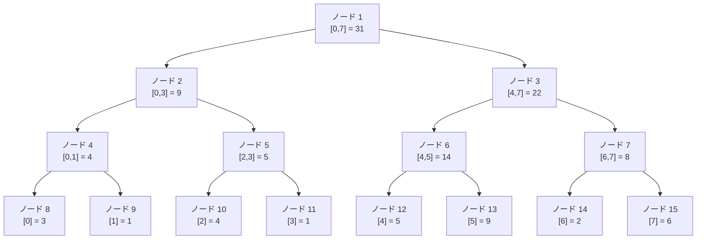

## セグメント木とは

セグメント木 (Segment Tree) は、配列に対する**区間クエリ**と**一点更新**を $O(\log n)$ で処理できるデータ構造である。区間の合計、最小値、最大値、GCD など、結合的な演算に対応できる。

### 基本的な性質

- 完全二分木として表現される
- 各ノードは配列の特定の区間に対応する
- 根は配列全体の区間 $[0, n-1]$ に対応する
- 各葉は配列の1要素に対応する
- 内部ノードは子ノードの値を統合した値を保持する

### 計算量

| 操作 | 時間計算量 |
|------|-----------|
| 構築 | $O(n)$ |
| 一点更新 | $O(\log n)$ |
| 区間クエリ | $O(\log n)$ |
| 空間計算量 | $O(n)$ |

## 構造

### 木の表現

サイズ $n$ の配列に対して、セグメント木はサイズ $4n$ の配列で表現される。ノード $k$ の子は $2k$ (左) と $2k+1$ (右) である。



上の例は配列 $[3, 1, 4, 1, 5, 9, 2, 6]$ の区間和セグメント木を表している。

### ノードの区間

ノード $k$ が区間 $[l, r]$ を担当するとき:

- $l = r$ なら葉ノード (配列の1要素に対応)
- $l < r$ なら、$m = \lfloor (l + r) / 2 \rfloor$ として:
  - 左の子 $2k$ は $[l, m]$ を担当
  - 右の子 $2k+1$ は $[m+1, r]$ を担当

## 構築

### アルゴリズム

再帰的にボトムアップで構築する。

1. 葉に到達したら、配列の対応する値をセットする
2. 内部ノードでは、両方の子を再帰的に構築した後、子の値を統合する

### 実装

```python title="segment_tree_build.py"
def build(tree, arr, node, start, end):
    if start == end:
        tree[node] = arr[start]
        return
    mid = (start + end) // 2
    build(tree, arr, 2 * node, start, mid)
    build(tree, arr, 2 * node + 1, mid + 1, end)
    tree[node] = tree[2 * node] + tree[2 * node + 1]
```

### 計算量の証明

セグメント木のノード数は高々 $4n - 5$ 個 (実際に使われるのは $2n - 1$ 個) であり、各ノードの処理は $O(1)$ なので、構築の時間計算量は $O(n)$ である。

## 区間クエリ

### アルゴリズム

区間 $[l, r]$ に対するクエリを処理するとき、各ノードについて以下の3つの場合に分類する。

1. **完全に区間外**: ノードの区間がクエリ区間と全く重ならない場合、単位元を返す
2. **完全に区間内**: ノードの区間がクエリ区間に完全に含まれる場合、ノードの値を返す
3. **部分的に重なる**: 上のどちらでもない場合、子ノードに再帰して結果を統合する

```python title="segment_tree_query.py"
def query(tree, node, start, end, l, r):
    if r < start or end < l:
        return 0  # identity element for sum
    if l <= start and end <= r:
        return tree[node]
    mid = (start + end) // 2
    left_val = query(tree, 2 * node, start, mid, l, r)
    right_val = query(tree, 2 * node + 1, mid + 1, end, l, r)
    return left_val + right_val
```

### 計算量の証明

**命題**: 区間クエリの時間計算量は $O(\log n)$ である。

**証明**: 各深さにおいて、「部分的に重なる」ノードは高々 2 個しか存在しないことを示す。

クエリ区間 $[l, r]$ に対して、ある深さで「部分的に重なる」ノードが 3 個以上存在すると仮定する。この 3 個のノードのうち、中央のノードは左端が $l$ より右かつ右端が $r$ より左なので、完全にクエリ区間に含まれる。これは「部分的に重なる」という仮定に矛盾する。

したがって各深さで訪れるノードは高々 4 個 (完全に含まれるノードと部分的に重なるノード) であり、深さは $O(\log n)$ なので全体の計算量は $O(\log n)$ である。 $\square$

## 一点更新

### アルゴリズム

位置 $i$ の値を $v$ に更新する場合:

1. 根から葉に向かって、位置 $i$ を含む区間を持つノードを辿る
2. 葉ノードの値を更新する
3. 帰りがけに、各内部ノードの値を子ノードから再計算する

```python title="segment_tree_update.py"
def update(tree, node, start, end, idx, val):
    if start == end:
        tree[node] = val
        return
    mid = (start + end) // 2
    if idx <= mid:
        update(tree, 2 * node, start, mid, idx, val)
    else:
        update(tree, 2 * node + 1, mid + 1, end, idx, val)
    tree[node] = tree[2 * node] + tree[2 * node + 1]
```

更新は根から葉までの1本のパス上のノードのみを変更するため、計算量は $O(\log n)$ である。

## 完全な実装

```python title="segment_tree.py"
class SegmentTree:
    def __init__(self, arr):
        self.n = len(arr)
        self.tree = [0] * (4 * self.n)
        self._build(arr, 1, 0, self.n - 1)

    def _build(self, arr, node, start, end):
        if start == end:
            self.tree[node] = arr[start]
            return
        mid = (start + end) // 2
        self._build(arr, 2 * node, start, mid)
        self._build(arr, 2 * node + 1, mid + 1, end)
        self.tree[node] = self.tree[2 * node] + self.tree[2 * node + 1]

    def update(self, idx, val):
        self._update(1, 0, self.n - 1, idx, val)

    def _update(self, node, start, end, idx, val):
        if start == end:
            self.tree[node] = val
            return
        mid = (start + end) // 2
        if idx <= mid:
            self._update(2 * node, start, mid, idx, val)
        else:
            self._update(2 * node + 1, mid + 1, end, idx, val)
        self.tree[node] = self.tree[2 * node] + self.tree[2 * node + 1]

    def query(self, l, r):
        return self._query(1, 0, self.n - 1, l, r)

    def _query(self, node, start, end, l, r):
        if r < start or end < l:
            return 0
        if l <= start and end <= r:
            return self.tree[node]
        mid = (start + end) // 2
        left_val = self._query(2 * node, start, mid, l, r)
        right_val = self._query(2 * node + 1, mid + 1, end, l, r)
        return left_val + right_val
```

## 非再帰実装

配列サイズを 2 の冪に拡張する方法を用いると、非再帰的に実装できる。配列サイズを $N$ (2 の冪) とし、サイズ $2N$ の配列を用意する。葉はインデックス $N, N+1, \ldots, 2N-1$ に対応する。

```python title="segment_tree_iterative.py"
class SegmentTreeIterative:
    def __init__(self, arr):
        self.n = len(arr)
        self.N = 1
        while self.N < self.n:
            self.N *= 2
        self.tree = [0] * (2 * self.N)
        # Set leaves
        for i in range(self.n):
            self.tree[self.N + i] = arr[i]
        # Build
        for i in range(self.N - 1, 0, -1):
            self.tree[i] = self.tree[2 * i] + self.tree[2 * i + 1]

    def update(self, idx, val):
        idx += self.N
        self.tree[idx] = val
        idx //= 2
        while idx >= 1:
            self.tree[idx] = self.tree[2 * idx] + self.tree[2 * idx + 1]
            idx //= 2

    def query(self, l, r):
        res = 0
        l += self.N
        r += self.N + 1
        while l < r:
            if l & 1:
                res += self.tree[l]
                l += 1
            if r & 1:
                r -= 1
                res += self.tree[r]
            l >>= 1
            r >>= 1
        return res
```

## 応用

### 区間最小値 (RMQ)

演算を `min` に、単位元を $\infty$ に変えるだけで区間最小値クエリに対応できる。

### 区間 GCD

演算を `gcd` に変えれば区間 GCD にも対応できる。

### 一般化

セグメント木は**モノイド** (結合法則を満たす演算 + 単位元) であれば任意の演算に対応できる。

| 演算 | 単位元 | 統合関数 |
|------|--------|----------|
| 和 | $0$ | $a + b$ |
| 最小値 | $+\infty$ | $\min(a, b)$ |
| 最大値 | $-\infty$ | $\max(a, b)$ |
| GCD | $0$ | $\gcd(a, b)$ |
| 積 | $1$ | $a \times b$ |

## まとめ

| 項目 | 内容 |
|------|------|
| 入力 | 長さ $n$ の配列 |
| 構築 | $O(n)$ |
| 一点更新 | $O(\log n)$ |
| 区間クエリ | $O(\log n)$ |
| 空間計算量 | $O(n)$ |
| 核心 | 完全二分木による区間の分割統治 |
| 応用 | RMQ、区間和、区間 GCD など |
