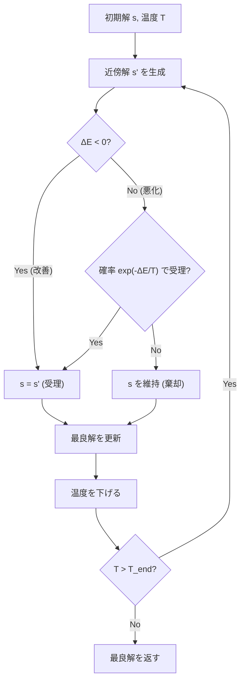

## 焼きなまし法とは

焼きなまし法 (Simulated Annealing, SA) は、金属の焼きなまし工程に着想を得た**メタヒューリスティクス**である。高温では大きな変化を許容し、徐々に温度を下げて安定な (最適に近い) 解に収束させる。

### 山登り法の限界

山登り法 (Hill Climbing) は現在の解より良い近傍解のみを受理するため、**局所最適解に陥る**。焼きなまし法は一定の確率で悪い解も受理することでこの問題を解決する。

## アルゴリズム

### メトロポリス基準

現在の解 $s$ に対して近傍解 $s'$ を生成し、エネルギー差 $\Delta E = f(s') - f(s)$ (最小化問題) を計算する。

受理確率は以下の**メトロポリス基準**で決まる。

$$
P(\text{accept}) = \begin{cases}
1 & \text{if } \Delta E < 0 \text{ (改善)} \\
\exp\left(-\frac{\Delta E}{T}\right) & \text{if } \Delta E \geq 0 \text{ (悪化)}
\end{cases}
$$

- $T$ が大きい (高温): 悪い解もよく受理される → 広い探索
- $T$ が小さい (低温): 悪い解はほとんど受理されない → 局所最適化

### 冷却スケジュール

温度 $T$ を徐々に下げていく。代表的なスケジュール:

| 種類 | 式 | 特徴 |
|------|-----|------|
| 線形冷却 | $T_{k+1} = T_k - \alpha$ | 単純だが非効率 |
| 幾何冷却 | $T_{k+1} = \alpha \cdot T_k$ ($\alpha \approx 0.99$) | 最も一般的 |
| 対数冷却 | $T_k = \frac{T_0}{\log(k+1)}$ | 理論的に最適だが遅い |

### 疑似コード

```python title="simulated_annealing.py"
import math
import random

def simulated_annealing(f, initial, neighbor, T_start, T_end, cooling):
    current = initial
    best = current
    T = T_start

    while T > T_end:
        candidate = neighbor(current)
        delta = f(candidate) - f(current)

        if delta < 0 or random.random() < math.exp(-delta / T):
            current = candidate
            if f(current) < f(best):
                best = current

        T *= cooling

    return best
```



## 理論的背景

### 収束定理

Hajek (1988) の定理によれば、対数冷却スケジュール

$$
T(k) = \frac{d}{\log(k + 1)}
$$

(ただし $d$ は問題に依存する定数) を使えば、焼きなまし法は確率 1 で大域的最適解に収束する。

しかしこの冷却速度は実用上極めて遅い。実際には幾何冷却 ($T \leftarrow \alpha T$, $\alpha \approx 0.99$) が使われることが多い。

### ボルツマン分布との関係

温度 $T$ での定常分布は

$$
\pi(s) \propto \exp\left(-\frac{f(s)}{T}\right)
$$

$T \to 0$ のとき、この分布は大域的最適解に集中する。

## パラメータ設計

### 初期温度

初期温度は「最初のうちはほぼ全ての遷移を受理する」程度に高くする。

実用的な方法: 初期状態でランダムに近傍遷移を試し、$\Delta E$ の平均を $\overline{\Delta E}$ とする。受理率 $p_0 \approx 0.8$ を目標にすると

$$
T_0 = -\frac{\overline{\Delta E}}{\log p_0}
$$

### 冷却率

幾何冷却の場合、$\alpha = 0.95 \sim 0.999$ が典型的である。

- $\alpha$ が小さい: 速く冷えるが解の品質が低い
- $\alpha$ が大きい: 解の品質は高いが時間がかかる

### 近傍の設計

近傍構造の選び方がアルゴリズムの性能を大きく左右する。

- **小さな近傍**: 局所的な改善に特化、収束は遅い
- **大きな近傍**: 解空間を広く探索、受理率が下がる

## 応用例

### 巡回セールスマン問題 (TSP)

- 解: 都市の訪問順序 (順列)
- 近傍: 2-opt (2辺を切って繋ぎ替え)、3-opt、Or-opt
- 評価: 総移動距離

```python title="tsp_sa.py"
def tsp_neighbor(tour):
    """2-opt neighbor"""
    n = len(tour)
    i = random.randint(0, n - 2)
    j = random.randint(i + 1, n - 1)
    new_tour = tour[:i] + tour[i:j+1][::-1] + tour[j+1:]
    return new_tour
```

### スケジューリング問題

- 解: ジョブの割り当て順序
- 近傍: ジョブのスワップ、移動
- 評価: 総完了時間、遅延ペナルティ

### VLSI 設計

- 解: チップ上の素子配置
- 近傍: 素子の移動、交換
- 評価: 配線長、面積

## 他の手法との比較

| 手法 | 局所最適回避 | メモリ | 理論保証 |
|------|------------|--------|---------|
| 山登り法 | 不可 | $O(1)$ | なし |
| 焼きなまし法 | 可能 | $O(1)$ | 収束定理あり |
| タブーサーチ | 可能 | $O(k)$ | なし |
| 遺伝的アルゴリズム | 可能 | $O(\text{pop})$ | なし |

焼きなまし法の最大の利点は、**実装が簡単**で**メモリ使用量が少ない**ことである。

## まとめ

| 項目 | 内容 |
|------|------|
| 種類 | メタヒューリスティクス |
| 着想 | 金属の焼きなまし工程 |
| 受理基準 | メトロポリス基準 |
| 冷却スケジュール | 幾何冷却が一般的 |
| 理論的収束 | 対数冷却で大域的最適解に収束 |
| 空間計算量 | $O(1)$ (追加メモリ) |
| 利点 | 実装が簡単、局所最適を回避 |
| 欠点 | パラメータ調整が必要 |
