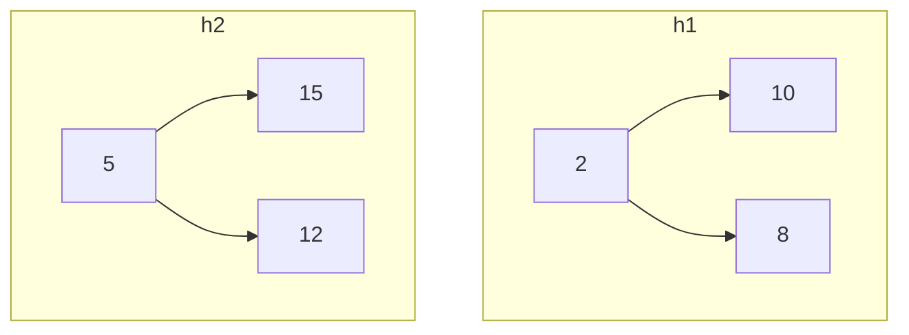

## Skew Heap とは

Skew Heap (スキューヒープ) は、Daniel Sleator と Robert Tarjan によって提案された自己調整型のマージ可能ヒープである。Leftist Heap を簡略化したもので、s値の管理を行わず、**マージ時に無条件で左右の子を交換する**ことで、償却 $O(\log n)$ のマージを実現する。

### Leftist Heap との比較

| | Leftist Heap | Skew Heap |
|---|---|---|
| s値の管理 | あり | なし |
| 左右の交換 | s値に基づいて条件付き | 無条件 |
| マージ計算量 | 最悪 $O(\log n)$ | 償却 $O(\log n)$ |
| 実装の簡潔さ | やや複雑 | 非常に簡潔 |

Skew Heap は Splay Tree のヒープ版とも言える。補助情報を一切持たず、構造操作だけで償却的な効率を保証する。

## 計算量

| 操作 | 計算量 |
|------|--------|
| merge | 償却 $O(\log n)$ |
| insert | 償却 $O(\log n)$ |
| find-min | $O(1)$ |
| delete-min | 償却 $O(\log n)$ |

## マージ操作

Skew Heap のマージは Leftist Heap とほぼ同じだが、**常に左右の子を交換する**点が異なる。

```python title="skew_heap.py"
def merge(h1, h2):
    if h1 is None:
        return h2
    if h2 is None:
        return h1
    if h1.key > h2.key:
        h1, h2 = h2, h1
    # Merge right child with h2, then swap children
    h1.right = merge(h1.right, h2)
    h1.left, h1.right = h1.right, h1.left
    return h1
```

### 動作の直感

無条件の交換は一見無駄に思えるが、これにより右スパインに偏りが蓄積されるのを防ぐ。マージのたびに右スパインのノードが左側に移動するため、次のマージ時の右スパインが短くなる。

## Insert と Delete-Min

### Insert

```python
def insert(h, key):
    return merge(h, SkewNode(key))
```

### Delete-Min

```python
def delete_min(h):
    if h is None:
        return None
    return merge(h.left, h.right)
```

## 償却解析

### ポテンシャル関数

ノード $x$ が**重い** (heavy) とは、$x$ の右部分木のサイズが $x$ の部分木全体のサイズの半分以上であることと定義する。

$$
\Phi(H) = \text{(重いノードの数)}
$$

### マージの償却計算量

2 つのヒープ $h_1$ ($n_1$ ノード) と $h_2$ ($n_2$ ノード) をマージする場合を考える。$n = n_1 + n_2$ とする。

マージは右スパインに沿って進む。右スパイン上の重いノードはマージ後に軽くなる可能性が高く (子の交換により)、これがポテンシャルの減少を生む。

右スパイン上の軽いノードの数は $O(\log n)$ 個以下である (軽いノードを辿るたびに部分木のサイズが半分以下になるため)。

実コストは右スパインの長さに比例し、ポテンシャルの減少は重いノードの数に比例する。これらを合わせると、

$$
\hat{c} = O(\log n)
$$

が得られる。 $\square$

## 具体例

ヒープ $h_1$ (根: 2) と $h_2$ (根: 5) のマージ:



1. $2 < 5$ なので $h_1$ を根とする
2. $h_1$ の右子 (8) と $h_2$ (5) を再帰マージ
3. $5 < 8$ なので 5 を根とし、5 の右子 (12) と 8 をマージ
4. $8 < 12$ なので 8 を根。左右交換: 12 が左子になる
5. 巻き戻し: 5 の左右交換
6. 2 の左右交換

## Top-Down 実装

上記の再帰的な実装に加えて、反復的な top-down 実装も可能である。右スパインを分解してリストにし、逆順にマージする方法で実装できる。

## まとめ

| 項目 | 内容 |
|------|------|
| データ構造 | ヒープ順序付き二分木 (補助情報なし) |
| 核心操作 | merge (無条件の左右交換) |
| マージ計算量 | 償却 $O(\log n)$ |
| 特徴 | s値不要で実装が簡潔 |
| 位置付け | Leftist Heap の自己調整版 |
