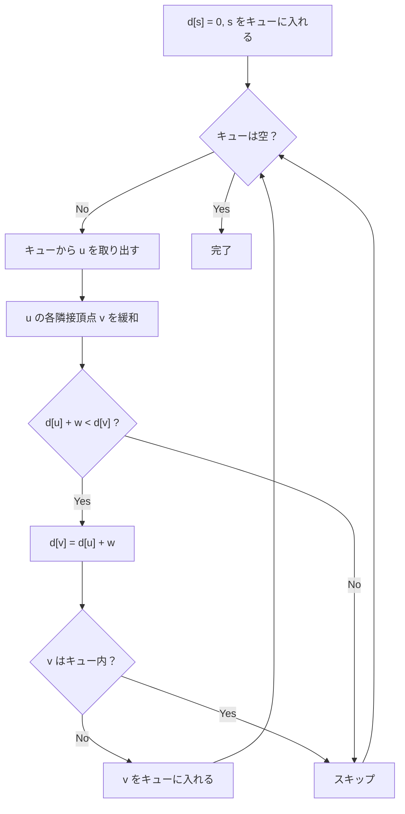

## SPFA とは

**SPFA (Shortest Path Faster Algorithm)** は、Bellman-Ford法をキューを用いて最適化した単一始点最短経路アルゴリズムである。1994年に段凡丁 (Duan Fanding) によって提案された。

Bellman-Ford法と同様に負の辺を扱えるが、更新された頂点のみを処理するため、多くの実用的なグラフでは大幅に高速化される。

### Bellman-Ford法との関係

Bellman-Ford法は毎回全辺を走査するが、実際には距離が更新された頂点の隣接辺だけを走査すれば十分である。SPFA はこの観察に基づき、更新された頂点をキューで管理する。

## アルゴリズムの動作

### 基本方針

1. 始点 $s$ をキューに入れ、$d[s] = 0$ とする
2. キューから頂点 $u$ を取り出す
3. $u$ の各隣接頂点 $v$ について緩和を行い、更新された $v$ がキューにいなければキューに入れる
4. キューが空になるまで繰り返す



### BFS との違い

BFS は各頂点を 1 回だけキューに入れるが、SPFA では距離が更新されるたびにキューに入れ直す可能性がある。

## 実装

```python title="spfa.py"
from collections import deque

def spfa(n: int, graph: list[list[tuple[int, int]]], start: int) -> tuple[list[float], bool]:
    INF = float('inf')
    dist = [INF] * n
    in_queue = [False] * n
    count = [0] * n  # number of times enqueued

    dist[start] = 0
    queue = deque([start])
    in_queue[start] = True
    count[start] = 1

    while queue:
        u = queue.popleft()
        in_queue[u] = False

        for v, w in graph[u]:
            if dist[u] + w < dist[v]:
                dist[v] = dist[u] + w
                if not in_queue[v]:
                    queue.append(v)
                    in_queue[v] = True
                    count[v] += 1
                    if count[v] >= n:
                        return dist, True  # negative cycle

    return dist, False
```

## 負の閉路の検出

ある頂点がキューに $|V|$ 回以上入れられた場合、負の閉路が存在する。最短パスは高々 $|V| - 1$ 本の辺からなるため、ある頂点が $|V|$ 回以上更新されることは負の閉路がない限り起こらない。

## 計算量

| 項目 | 計算量 |
|------|--------|
| 最悪時間計算量 | $O(VE)$ |
| 平均時間計算量 | $O(E)$ (経験的) |
| 空間計算量 | $O(V)$ |

最悪計算量は Bellman-Ford法と同じ $O(VE)$ だが、実用的には多くのグラフで $O(E)$ 程度の高速な動作が期待できる。ただし、意図的に最悪ケースを構成でき、競技プログラミングでは "anti-SPFA" テストケースが含まれることがある。

## SLF 最適化

**SLF (Shortest Label First)** は SPFA の性能を向上させるテクニックである。キューに頂点を追加するとき、その暫定距離がキュー先頭の頂点の距離より小さければ先頭に挿入する。

```python title="spfa_slf.py"
from collections import deque

def spfa_slf(n: int, graph: list[list[tuple[int, int]]], start: int) -> list[float]:
    INF = float('inf')
    dist = [INF] * n
    in_queue = [False] * n
    dist[start] = 0
    queue = deque([start])
    in_queue[start] = True

    while queue:
        u = queue.popleft()
        in_queue[u] = False
        for v, w in graph[u]:
            if dist[u] + w < dist[v]:
                dist[v] = dist[u] + w
                if not in_queue[v]:
                    # SLF: insert at front if shorter
                    if queue and dist[v] < dist[queue[0]]:
                        queue.appendleft(v)
                    else:
                        queue.append(v)
                    in_queue[v] = True

    return dist
```

## Bellman-Ford法・Dijkstra法との比較

| 観点 | Dijkstra法 | Bellman-Ford法 | SPFA |
|------|-----------|---------------|------|
| 負の辺 | 不可 | 可 | 可 |
| 最悪計算量 | $O((V+E) \log V)$ | $O(VE)$ | $O(VE)$ |
| 平均計算量 | $O((V+E) \log V)$ | $O(VE)$ | $O(E)$ (経験的) |
| 使用場面 | 非負重み | 負の辺あり | 負の辺あり (実用的に高速) |

## 応用

### 差分制約系

Bellman-Ford法と同様に、差分制約系の解を求めるのに使える。

### 費用流

最小費用流アルゴリズムの内部ルーチンとして SPFA が使われることがある。

## まとめ

| 項目 | 内容 |
|------|------|
| 入力 | 重み付き有向グラフ $G$、始点 $s$ |
| 出力 | 各頂点への最短距離、負の閉路の有無 |
| 最悪時間計算量 | $O(VE)$ |
| 空間計算量 | $O(V)$ |
| 核心 | 更新された頂点のみをキューで管理 |
| 利点 | 実用的には高速 |
| 注意 | 最悪ケースでは Bellman-Ford と同等 |
