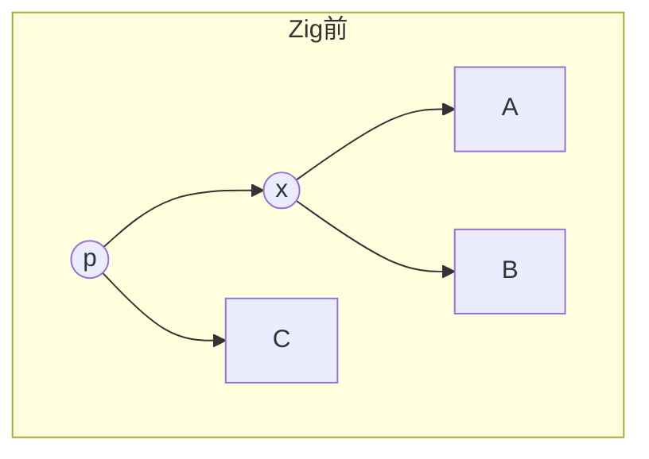
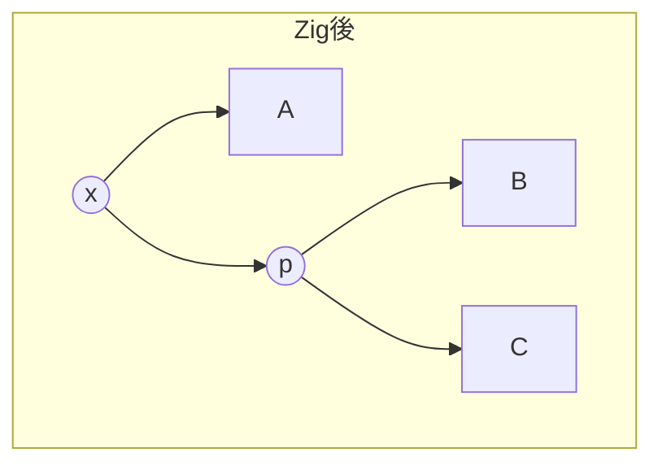
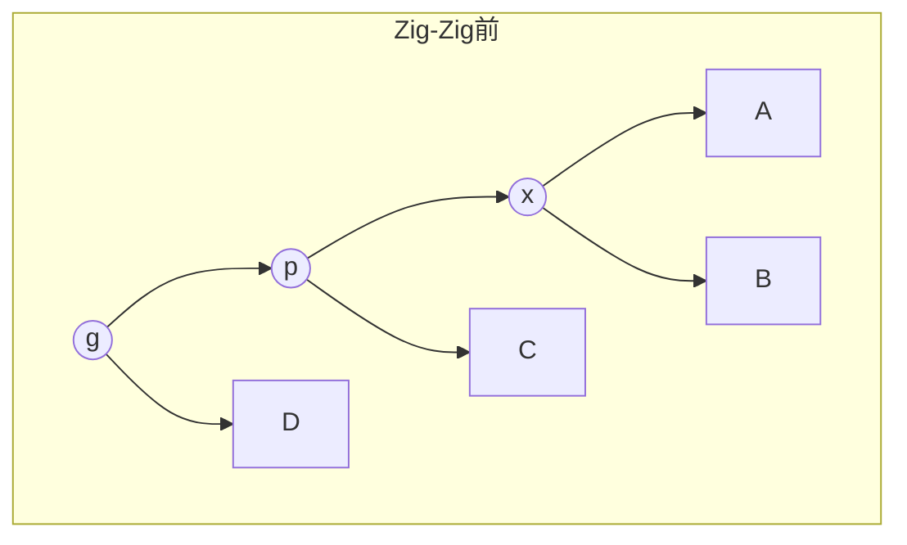

## Splay木とは

**Splay木** は、1985年にSleatorとTarjanによって提案された自己調整型二分探索木である。アクセスされたノードを**スプレー操作 (splay)** によって根まで移動させることで、頻繁にアクセスされるデータを高速に探索できるようにする。

AVL木や赤黒木とは異なり、明示的な平衡条件を持たない。代わりに、**ならし計算量 (amortized complexity)** が $O(\log n)$ であることが保証される。

### 特徴

- 各操作の最悪計算量は $O(n)$ だが、$m$ 回の操作の合計は $O(m \log n)$
- 最近アクセスしたデータに再びアクセスする場合に高速 (時間的局所性)
- 実装が比較的単純
- 余分な情報 (高さ、色など) をノードに保持する必要がない

## スプレー操作

スプレー操作は、対象ノードを根まで引き上げる操作であり、3種類の回転の組み合わせで構成される。

### Zig (単回転)

対象ノード $x$ の親 $p$ が根の場合に行う。$p$ で回転して $x$ を根にする。





### Zig-Zig (同方向の二重回転)

$x$ と $p$ が同じ方向の子 (共に左の子、または共に右の子) の場合。**祖父 $g$ で先に回転し、次に $p$ で回転する** (順序が重要)。



### Zig-Zag (異方向の二重回転)

$x$ と $p$ が異なる方向の子の場合。$p$ で回転し、次に $g$ で回転する。

## なぜ Zig-Zig の回転順序が重要か

素朴に $x$ を根まで回転させる (rotate to root) 方法では、ならし $O(\log n)$ が達成できない。Zig-Zigで**祖父から先に回転する**ことが、ならし解析の鍵である。

直感的には、Zig-Zigの回転順序によって、深いノードをスプレーすると木全体が「浅く」なる効果がある。

## スプレー操作の実装

```python title="splay.py"
def splay(root, x):
    while x.parent is not None:
        p = x.parent
        g = p.parent
        if g is None:
            # Zig
            if x == p.left:
                root = right_rotate(root, p)
            else:
                root = left_rotate(root, p)
        elif x == p.left and p == g.left:
            # Zig-Zig (left-left)
            root = right_rotate(root, g)
            root = right_rotate(root, p)
        elif x == p.right and p == g.right:
            # Zig-Zig (right-right)
            root = left_rotate(root, g)
            root = left_rotate(root, p)
        elif x == p.right and p == g.left:
            # Zig-Zag (left-right)
            root = left_rotate(root, p)
            root = right_rotate(root, g)
        else:
            # Zig-Zag (right-left)
            root = right_rotate(root, p)
            root = left_rotate(root, g)
    return root
```

## 基本操作

### 探索

通常のBST探索を行い、見つかったノード (または最後にアクセスしたノード) をスプレーする。

### 挿入

1. 通常のBST挿入
2. 挿入したノードをスプレー

### 削除

1. 削除対象をスプレーして根にする
2. 左部分木の最大値をスプレーして左部分木の根にする
3. 左部分木の根の右の子に右部分木を接続

## ならし計算量

**定理 (Access Lemma):** $n$ ノードのSplay木に対する $m$ 回の操作のならし合計計算量は $O((m + n) \log n)$ である。

**証明の概略:**

ポテンシャル関数 $\Phi = \sum_{v} \log s(v)$ を定義する。ここで $s(v)$ はノード $v$ を根とする部分木のサイズである。

各スプレー操作のならしコストは $O(\log n)$ となることが、ポテンシャル関数の変化量を解析することで示される。

### 最適性に関する諸予想

Splay木には以下の未解決予想がある。

- **動的最適性予想**: Splay木は任意のアクセス列に対して、他の全てのBSTと同程度に高速である (定数倍の差を除いて)
- **Working Set定理**: 最近アクセスした要素へのアクセスは高速

## まとめ

| 項目 | 内容 |
|------|------|
| 提案者 | Sleator, Tarjan (1985) |
| 平衡条件 | なし (自己調整型) |
| ならし計算量 | $O(\log n)$ per operation |
| 最悪計算量 | $O(n)$ per operation |
| 核心操作 | Splay (Zig, Zig-Zig, Zig-Zag) |
| 利点 | 実装が簡潔、局所性に適応 |
| 欠点 | 最悪ケースが $O(n)$、並行処理が困難 |
