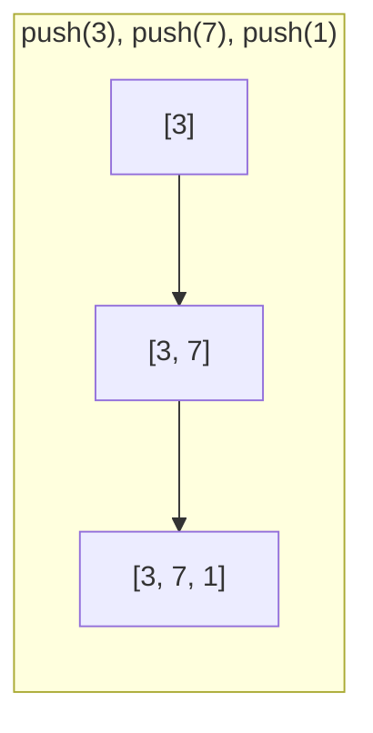
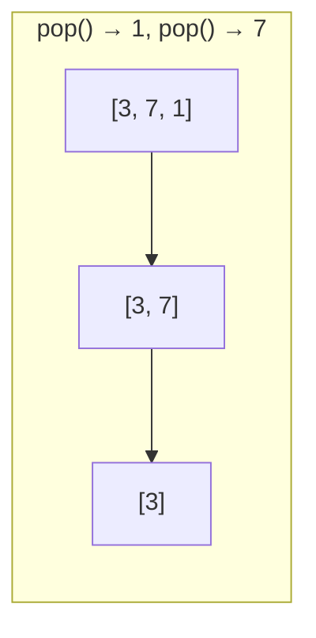

## Stack とは

Stack (スタック) は **LIFO (Last In, First Out: 後入れ先出し)** の原則に基づくデータ構造である。最後に追加された要素が最初に取り出される。

日常的な例として、積み上げられた皿を想像するとわかりやすい。新しい皿は一番上に置かれ、取り出すときも一番上から取る。

### 基本操作

| 操作 | 説明 | 時間計算量 |
|------|------|------------|
| `push(x)` | 要素 $x$ をスタックの先頭に追加 | $O(1)$ |
| `pop()` | スタックの先頭から要素を取り出す | $O(1)$ |
| `peek()` / `top()` | 先頭の要素を取り出さずに参照 | $O(1)$ |
| `isEmpty()` | スタックが空かどうかを返す | $O(1)$ |
| `size()` | スタック内の要素数を返す | $O(1)$ |

全ての基本操作が $O(1)$ で実行できることが Stack の大きな特長である。

## 配列による実装

最もシンプルな実装は、配列とスタックの先頭位置を表す変数 (トップポインタ) を使う方法である。

```python title="stack_array.py"
class Stack:
    def __init__(self, capacity: int):
        self.data = [None] * capacity
        self.top = -1  # -1 means empty
        self.capacity = capacity

    def push(self, x):
        if self.top == self.capacity - 1:
            raise OverflowError("Stack overflow")
        self.top += 1
        self.data[self.top] = x

    def pop(self):
        if self.top == -1:
            raise IndexError("Stack underflow")
        val = self.data[self.top]
        self.top -= 1
        return val

    def peek(self):
        if self.top == -1:
            raise IndexError("Stack is empty")
        return self.data[self.top]

    def is_empty(self) -> bool:
        return self.top == -1

    def size(self) -> int:
        return self.top + 1
```

### 動作の流れ





## 連結リストによる実装

配列のサイズ制限を回避するために、連結リスト (Linked List) を使って実装することもできる。

```python title="stack_linked.py"
class Node:
    def __init__(self, val, next_node=None):
        self.val = val
        self.next = next_node

class LinkedStack:
    def __init__(self):
        self.head = None
        self._size = 0

    def push(self, x):
        self.head = Node(x, self.head)
        self._size += 1

    def pop(self):
        if self.head is None:
            raise IndexError("Stack underflow")
        val = self.head.val
        self.head = self.head.next
        self._size -= 1
        return val

    def peek(self):
        if self.head is None:
            raise IndexError("Stack is empty")
        return self.head.val

    def is_empty(self) -> bool:
        return self.head is None

    def size(self) -> int:
        return self._size
```

連結リスト版は容量制限がなく、push/pop は依然として $O(1)$ である。ただし、各要素にポインタ分のメモリオーバーヘッドが生じる。

## 計算量

| 実装方法 | push | pop | peek | 空間計算量 |
|----------|------|-----|------|------------|
| 配列 (固定長) | $O(1)$ | $O(1)$ | $O(1)$ | $O(n)$ |
| 動的配列 | 償却 $O(1)$ | $O(1)$ | $O(1)$ | $O(n)$ |
| 連結リスト | $O(1)$ | $O(1)$ | $O(1)$ | $O(n)$ |

動的配列の場合、配列の拡張時にコピーが発生するが、倍々で拡張すれば push の**償却計算量**は $O(1)$ になる。

### 償却計算量の証明 (動的配列)

容量が足りなくなったとき、配列サイズを 2 倍にする戦略を考える。

$n$ 回の push について、コピーが発生するのは配列サイズが $1, 2, 4, 8, \ldots$ に達した時点である。コピー回数の総和は

$$
1 + 2 + 4 + \cdots + 2^{\lfloor \log_2 n \rfloor} \leq 2n
$$

よって $n$ 回の push の総コストは $O(n)$ であり、1回あたりの償却計算量は $O(1)$ である。

## 応用

Stack は多くのアルゴリズムや実際のシステムで利用される。

### 関数呼び出しスタック

プログラムの実行時、関数の呼び出しはスタックで管理される。関数が呼ばれるとスタックにフレームが積まれ、return するとフレームが取り除かれる。再帰呼び出しが深すぎるとスタックオーバーフローが発生する。

### 括弧の対応チェック

```python title="bracket_check.py"
def is_valid(s: str) -> bool:
    stack = []
    pairs = {')': '(', ']': '[', '}': '{'}
    for c in s:
        if c in '([{':
            stack.append(c)
        elif c in ')]}':
            if not stack or stack[-1] != pairs[c]:
                return False
            stack.pop()
    return len(stack) == 0
```

### 後置記法 (逆ポーランド記法) の計算

数式 `3 4 + 2 *` を評価する場合、数値をスタックに push し、演算子に出会ったら 2 つの値を pop して計算結果を push する。

### 深さ優先探索 (DFS)

グラフの深さ優先探索は、再帰を使わずにスタックで実装できる。

## まとめ

| 項目 | 内容 |
|------|------|
| データ構造 | Stack (スタック) |
| 原則 | LIFO (Last In, First Out) |
| 基本操作 | push, pop, peek |
| 時間計算量 | 全操作 $O(1)$ |
| 空間計算量 | $O(n)$ |
| 主な応用 | 関数呼び出し管理、括弧チェック、DFS、式の評価 |
