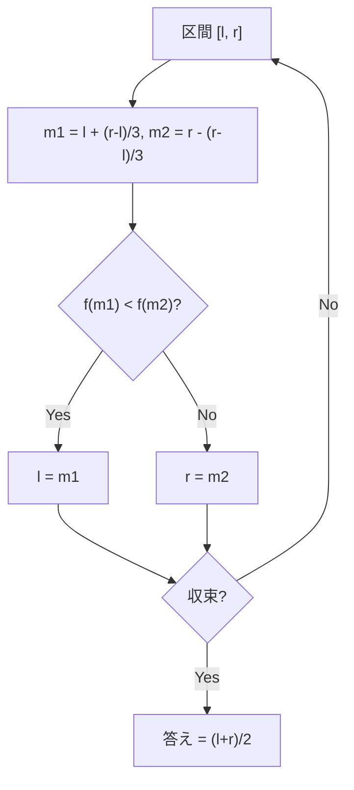

## 三分探索とは

三分探索 (Ternary Search) は、**凸関数** (unimodal function) の極値を効率的に求めるアルゴリズムである。探索区間を毎回 $2/3$ に縮小することで、$O(\log n)$ の反復で最適値を求める。

### 問題設定

区間 $[l, r]$ 上で定義された凸関数 $f(x)$ の最大値 (または最小値) を求めたい。

凸関数とは、ある点 $x^*$ を境に:
- $x < x^*$ では $f$ が単調増加
- $x > x^*$ では $f$ が単調減少

となるような関数である (上に凸の場合)。下に凸の場合は逆になる。

## アルゴリズム

### 基本的なアイデア

区間 $[l, r]$ を三等分する2つの点 $m_1$, $m_2$ を取る。

$$
m_1 = l + \frac{r - l}{3}, \quad m_2 = r - \frac{r - l}{3}
$$

$f(m_1)$ と $f(m_2)$ を比較することで、極値の存在する区間を $2/3$ に絞り込める。

### 上に凸な関数の最大値を求める場合

- $f(m_1) < f(m_2)$: 最大値は $m_1$ より右にある → $l = m_1$
- $f(m_1) > f(m_2)$: 最大値は $m_2$ より左にある → $r = m_2$
- $f(m_1) = f(m_2)$: 最大値は $[m_1, m_2]$ にある → $l = m_1$ または $r = m_2$



### なぜ正しいか

上に凸な関数 $f$ の最大点を $x^*$ とする。

**Case: $f(m_1) < f(m_2)$**

$m_1 < m_2$ であり、$f(m_1) < f(m_2)$ のとき、$x^* \leq m_1$ と仮定すると矛盾が生じる。$x^* \leq m_1 < m_2$ なので $f$ は $[m_1, m_2]$ で単調減少のはずだが、$f(m_1) < f(m_2)$ はこれに矛盾する。したがって $x^* > m_1$ であり、$l = m_1$ としても極値を含む区間は保たれる。

**Case: $f(m_1) > f(m_2)$** も同様の議論で $x^* < m_2$ が示される。

## 実装

```python title="ternary_search.py"
def ternary_search_max(f, lo: float, hi: float, eps: float = 1e-9) -> float:
    for _ in range(200):
        if hi - lo < eps:
            break
        m1 = lo + (hi - lo) / 3
        m2 = hi - (hi - lo) / 3
        if f(m1) < f(m2):
            lo = m1
        else:
            hi = m2
    return (lo + hi) / 2
```

### 整数上の三分探索

離散的な値に対しても適用できる。

```python title="ternary_search_int.py"
def ternary_search_max_int(f, lo: int, hi: int) -> int:
    while hi - lo > 2:
        m1 = lo + (hi - lo) // 3
        m2 = hi - (hi - lo) // 3
        if f(m1) < f(m2):
            lo = m1
        else:
            hi = m2
    # Check remaining candidates
    best = lo
    for x in range(lo, hi + 1):
        if f(x) > f(best):
            best = x
    return best
```

## 計算量

### 時間計算量

各反復で区間が $2/3$ 倍に縮小するので、$k$ 回の反復後の区間幅は $(2/3)^k \cdot (r - l)$ である。

精度 $\varepsilon$ を達成するのに必要な反復回数は

$$
k = O\left(\log_{3/2} \frac{r - l}{\varepsilon}\right) = O\left(\log \frac{r - l}{\varepsilon}\right)
$$

各反復で関数を 2 回評価するので、関数評価回数は $O\left(\log \frac{r-l}{\varepsilon}\right)$ 回である。

### 二分探索との比較

三分探索の収束率は $2/3 \approx 0.667$ であるのに対し、黄金分割探索は $(3 - \sqrt{5})/2 \approx 0.382$ で、各反復での関数評価回数は 1 回で済む。

したがって、関数評価のコストが高い場合は黄金分割探索の方が効率的である。

## 応用

### 凸関数の最適化

三分探索は以下のような問題に適用できる:

- 凸関数の最大値・最小値の求解
- 競技プログラミングでの最適値の探索
- 物理シミュレーションでのパラメータ最適化

### 注意点

- 対象の関数が**厳密に凸** (unimodal) でなければ正しく動作しない
- 多峰関数には適用できない
- 離散的な場合は区間幅が 2 以下になるまでループし、残りを全探索する

## まとめ

| 項目 | 内容 |
|------|------|
| 入力 | 凸関数 $f$, 区間 $[l, r]$ |
| 出力 | $f$ の極値を取る $x$ |
| 時間計算量 | $O(\log((r-l)/\varepsilon))$ |
| 空間計算量 | $O(1)$ |
| 前提条件 | $f$ が凸 (unimodal) であること |
| 関数評価回数 | 各反復で 2 回 |
