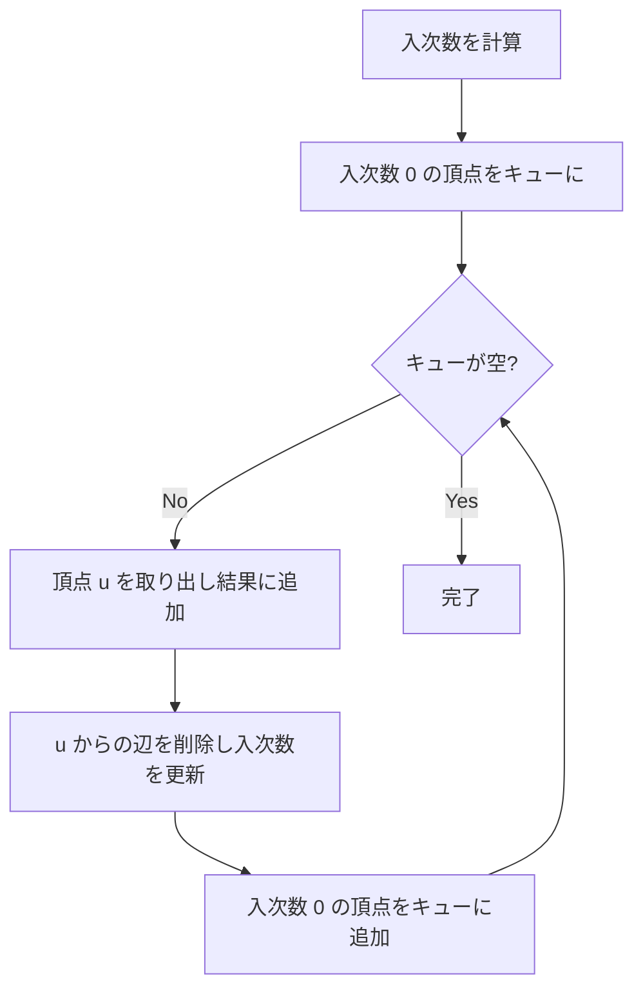

## トポロジカルソートとは

トポロジカルソートは、**有向非巡回グラフ (DAG: Directed Acyclic Graph)** の頂点を、全ての辺 $(u, v)$ について $u$ が $v$ より前に来るように線形に並べる操作である。

### 定義

有向グラフ $G = (V, E)$ に対して、頂点の順列 $v_1, v_2, \ldots, v_n$ がトポロジカル順序であるとは、全ての辺 $(v_i, v_j) \in E$ に対して $i < j$ が成り立つことである。

### 存在条件

グラフがトポロジカル順序を持つための必要十分条件は、グラフが DAG であることである。

## Kahn のアルゴリズム (BFS ベース)

### アルゴリズムの流れ

1. 各頂点の入次数を計算する
2. 入次数 0 の頂点をキューに入れる
3. キューから頂点を取り出し、結果に追加する
4. その頂点から出る辺を削除し、隣接頂点の入次数を 1 減らす
5. 入次数が 0 になった頂点をキューに追加する
6. キューが空になるまで繰り返す



### 実装

```python title="topological_sort_kahn.py"
from collections import deque

def topological_sort_kahn(n: int, edges: list[tuple[int, int]]) -> list[int]:
    adj = [[] for _ in range(n)]
    in_degree = [0] * n
    for u, v in edges:
        adj[u].append(v)
        in_degree[v] += 1

    queue = deque(i for i in range(n) if in_degree[i] == 0)
    result = []

    while queue:
        u = queue.popleft()
        result.append(u)
        for v in adj[u]:
            in_degree[v] -= 1
            if in_degree[v] == 0:
                queue.append(v)

    if len(result) != n:
        raise ValueError("Graph has a cycle")
    return result
```

## DFS ベースのアルゴリズム

DFS の帰りがけ順を逆転させることでもトポロジカル順序が得られる。

```python title="topological_sort_dfs.py"
def topological_sort_dfs(n: int, edges: list[tuple[int, int]]) -> list[int]:
    adj = [[] for _ in range(n)]
    for u, v in edges:
        adj[u].append(v)

    visited = [0] * n  # 0: unvisited, 1: in progress, 2: done
    result = []

    def dfs(u: int) -> bool:
        visited[u] = 1
        for v in adj[u]:
            if visited[v] == 1:
                return False  # cycle detected
            if visited[v] == 0:
                if not dfs(v):
                    return False
        visited[u] = 2
        result.append(u)
        return True

    for i in range(n):
        if visited[i] == 0:
            if not dfs(i):
                raise ValueError("Graph has a cycle")

    result.reverse()
    return result
```

### なぜ帰りがけ順の逆が正しいのか

辺 $(u, v) \in E$ がある場合、DFS で $u$ を探索中に $v$ が先に完了する。したがって帰りがけ順では $v$ が $u$ より先に追加される。逆転すると $u$ が $v$ より前に来る。これは全ての辺について成り立つので、トポロジカル順序が得られる。

## 計算量

| 操作 | 計算量 |
|------|--------|
| 入次数計算 | $O(V + E)$ |
| BFS/DFS | $O(V + E)$ |
| **合計** | $O(V + E)$ |

空間計算量は $O(V + E)$ である。

## 応用

- **ビルドシステム**: ファイルの依存関係に基づくコンパイル順序の決定
- **タスクスケジューリング**: 前提条件のあるタスクの実行順序
- **コース履修計画**: 前提科目を満たす履修順序
- **式の評価順序**: スプレッドシートのセル依存関係の解決

## まとめ

| 項目 | 内容 |
|------|------|
| 入力 | 有向非巡回グラフ (DAG) |
| 出力 | 頂点のトポロジカル順序 |
| 時間計算量 | $O(V + E)$ |
| 空間計算量 | $O(V + E)$ |
| 核心 | 入次数 0 の頂点を繰り返し除去 (Kahn) / DFS の帰りがけ順逆転 |
| 応用 | ビルドシステム、タスクスケジューリング |
