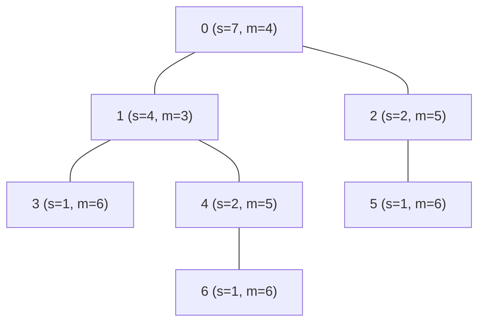

## 木の重心とは

木の**重心 (centroid)** とは、その頂点を削除したときに残る各連結成分のサイズの最大値が最小となる頂点である。

### 定義

$n$ 頂点の木 $T = (V, E)$ において、頂点 $v$ を削除したときに得られる各連結成分のサイズの最大値を $f(v)$ とする。

$$
f(v) = \max_{C \in \text{components}(T \setminus \{v\})} |C|
$$

木の重心とは $f(v)$ を最小化する頂点 $v$ のことである。

$$
\text{centroid}(T) = \arg\min_{v \in V} f(v)
$$

### 具体例



s = 部分木サイズ、m = 最大連結成分サイズ。ノード 1 の m=3 が最小なので重心。

## 重心の性質

### 定理 1: 重心は高々 2 つ

木の重心は 1 つまたは 2 つである。2 つの場合、それらは辺で隣接している。

**証明:**

重心 $c$ について $f(c) \leq \lfloor n/2 \rfloor$ であることを示す。

$c$ をルートとする根付き木を考える。最大の部分木のサイズを $s$ とすると $f(c) = \max(s, n - 1 - s)$ (ここで $n - 1 - s$ は他の全部分木と合わせたもの)。

もし 2 つ以上の重心 $c_1, c_2, c_3$ が存在し、それらが三角形をなさないとすると (木なので)、いずれかの間のパス上に $f$ がより小さい頂点が存在して矛盾する。

よって重心は高々 2 つであり、2 つの場合は辺で隣接する。 $\square$

### 定理 2: 重心の特徴付け

頂点 $v$ が重心である必要十分条件は、$v$ を削除したときの全ての連結成分のサイズが $\lfloor n/2 \rfloor$ 以下であること。

$$
v \text{ が重心} \Leftrightarrow f(v) \leq \lfloor n/2 \rfloor
$$

**証明:**

$f(v) \leq \lfloor n/2 \rfloor$ の頂点 $v$ が存在することを示す。$v$ の隣接頂点 $u$ について、$u$ 側の部分木サイズが $\lfloor n/2 \rfloor$ を超えるなら $u$ の方が $f$ の値が小さくなる。この議論を繰り返すと $f(v) \leq \lfloor n/2 \rfloor$ の頂点に到達する。

逆に $f(v) > \lfloor n/2 \rfloor$ なら、サイズが $\lfloor n/2 \rfloor$ を超える成分の方向に移動すると $f$ が減少する。 $\square$

## アルゴリズム

### DFS による方法

1. 適当な頂点をルートとして DFS で部分木サイズを計算
2. 各頂点 $v$ について $f(v) = \max(\text{各子の部分木サイズ}, n - \text{size}(v))$ を計算
3. $f(v)$ が最小の頂点が重心

### 実装

```python title="tree_centroid.py"
def find_centroid(n: int, adj: list[list[int]]) -> list[int]:
    subtree_size = [0] * n
    parent = [-1] * n

    # Iterative DFS to compute subtree sizes
    order = []
    visited = [False] * n
    stack = [0]
    visited[0] = True
    while stack:
        u = stack.pop()
        order.append(u)
        for v in adj[u]:
            if not visited[v]:
                visited[v] = True
                parent[v] = u
                stack.append(v)

    # Process in reverse order (leaves first)
    for u in reversed(order):
        subtree_size[u] = 1
        for v in adj[u]:
            if v != parent[u]:
                subtree_size[u] += subtree_size[v]

    # Find centroid
    min_max = n
    centroids = []
    for u in range(n):
        max_comp = n - subtree_size[u]  # parent side
        for v in adj[u]:
            if v != parent[u]:
                max_comp = max(max_comp, subtree_size[v])
        if max_comp < min_max:
            min_max = max_comp
            centroids = [u]
        elif max_comp == min_max:
            centroids.append(u)

    return centroids
```

### 計算量

| 項目 | 計算量 |
|------|--------|
| 時間計算量 | $O(n)$ |
| 空間計算量 | $O(n)$ |

## 応用

### 重心分解

木の重心を再帰的に求めることで**重心分解 (centroid decomposition)** が得られる。これは木上のパスクエリを効率的に処理する強力な手法である。

### バランスの良い分割

重心で木を分割すると、各部分の頂点数は高々 $\lfloor n/2 \rfloor$ になる。この性質は分割統治法を適用する際に重要である。

## まとめ

| 項目 | 内容 |
|------|------|
| 入力 | $n$ 頂点の木 |
| 出力 | 重心 (1つまたは2つ) |
| 時間計算量 | $O(n)$ |
| 空間計算量 | $O(n)$ |
| 核心 | 部分木サイズの最大値を最小化 |
| 応用 | 重心分解、バランスの良い分割 |
