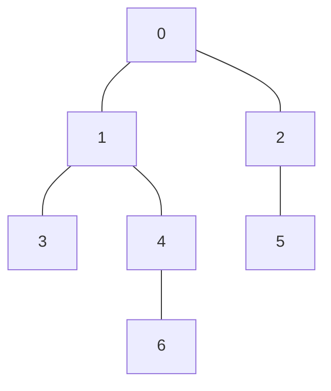

## 木の直径とは

木の**直径 (diameter)** とは、木に含まれる全ての頂点対 $(u, v)$ の間の距離 $d(u, v)$ の最大値である。

$$
\text{diameter}(T) = \max_{u, v \in V} d(u, v)
$$

直感的には、木の中で最も離れた 2 つの頂点間の距離が直径である。

### 具体例



この木の直径は 4 (ノード 3 からノード 5、またはノード 6 からノード 5 のパス) である。

## 2 回の BFS/DFS による算出

### アルゴリズム

木の直径は 2 回の BFS (または DFS) で $O(n)$ で求められる。

1. 任意の頂点 $s$ から BFS を行い、最も遠い頂点 $u$ を見つける
2. 頂点 $u$ から BFS を行い、最も遠い頂点 $v$ を見つける
3. $d(u, v)$ が木の直径である

### 正当性の証明

**定理:** 任意の頂点 $s$ から最も遠い頂点 $u$ は、直径のパスの端点の一つである。

**証明:**

直径のパスの両端を $a, b$ とする ($d(a, b) = D$)。$s$ から最も遠い頂点 $u$ について $d(s, u) \geq d(s, a)$ かつ $d(s, u) \geq d(s, b)$ である。

$u$ が直径のパスの端点でないと仮定して矛盾を導く。

木なので $s$ から $a$, $b$, $u$ への各パスは一意である。$s$-$a$ パスと $s$-$b$ パスが分岐する点を $c$ とする。このとき:

$$
d(a, b) = d(a, c) + d(c, b) = D
$$

$u$ から $a$-$b$ パスの最も近い点を $p$ とすると:

$$
d(u, a) = d(u, p) + d(p, a)
$$
$$
d(u, b) = d(u, p) + d(p, b)
$$

$d(u, a) > D$ または $d(u, b) > D$ であれば直径の定義に矛盾する。よって $d(u, a) \leq D$ かつ $d(u, b) \leq D$。

一方で $d(s, u) \geq d(s, a)$ より、$u$ は $s$ から $a$ と同じか遠い。$d(u, b) \geq d(a, b) = D$ が示せ、$d(u, b) = D$ となり $u$ は直径の端点となる。 $\square$

### 実装

```python title="tree_diameter.py"
from collections import deque

def tree_diameter(n: int, adj: list[list[int]]) -> int:
    def bfs(start: int) -> tuple[int, int]:
        """Returns (farthest node, distance to it)."""
        dist = [-1] * n
        dist[start] = 0
        queue = deque([start])
        farthest = start
        while queue:
            u = queue.popleft()
            for v in adj[u]:
                if dist[v] == -1:
                    dist[v] = dist[u] + 1
                    queue.append(v)
                    if dist[v] > dist[farthest]:
                        farthest = v
        return farthest, dist[farthest]

    # BFS 1: find one endpoint of diameter
    u, _ = bfs(0)
    # BFS 2: find the other endpoint
    v, diameter = bfs(u)
    return diameter
```

### 計算量

| 項目 | 計算量 |
|------|--------|
| 時間計算量 | $O(n)$ |
| 空間計算量 | $O(n)$ |

BFS を 2 回行うだけなので、木の頂点数 $n$ に対して線形時間で動作する。

## 全点対最短路による方法

全ての頂点対の距離を求めれば直径が得られるが、$O(n^2)$ かかるため非効率である。2 回の BFS による方法の方が優れている。

## 重み付き木の直径

辺に重み $w(e)$ がある場合も、同じ 2 回 BFS のアルゴリズムが使える。BFS を重み付きの最短路探索 (Dijkstra や BFS の変形) に置き換えるだけでよい。

重みが非負の場合、正当性の証明はほぼ同じである。

## 直径パスの復元

直径の長さだけでなくパス自体を求めたい場合は、2 回目の BFS で親を記録しておき、最遠頂点から逆向きにたどればよい。

```python title="tree_diameter_path.py"
from collections import deque

def diameter_path(n: int, adj: list[list[int]]) -> list[int]:
    def bfs(start: int) -> tuple[int, list[int]]:
        dist = [-1] * n
        parent = [-1] * n
        dist[start] = 0
        queue = deque([start])
        farthest = start
        while queue:
            u = queue.popleft()
            for v in adj[u]:
                if dist[v] == -1:
                    dist[v] = dist[u] + 1
                    parent[v] = u
                    queue.append(v)
                    if dist[v] > dist[farthest]:
                        farthest = v
        # Reconstruct path
        path = []
        cur = farthest
        while cur != -1:
            path.append(cur)
            cur = parent[cur]
        return farthest, path[::-1]

    u, _ = bfs(0)
    v, path = bfs(u)
    return path
```

## 応用

| 応用 | 説明 |
|------|------|
| ネットワーク設計 | 通信遅延の最悪ケース評価 |
| 木の中心 | 直径パスの中点が木の中心 |
| 木の半径 | 中心から最遠頂点までの距離 |
| 木 DP | 直径パスを軸にした分割統治 |

## まとめ

| 項目 | 内容 |
|------|------|
| 入力 | $n$ 頂点の木 |
| 出力 | 直径 (最遠頂点対の距離) |
| 時間計算量 | $O(n)$ |
| 空間計算量 | $O(n)$ |
| 核心 | 2 回の BFS で端点を特定 |
| 応用 | ネットワーク設計、木の中心 |
