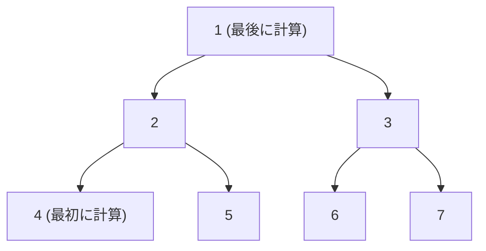
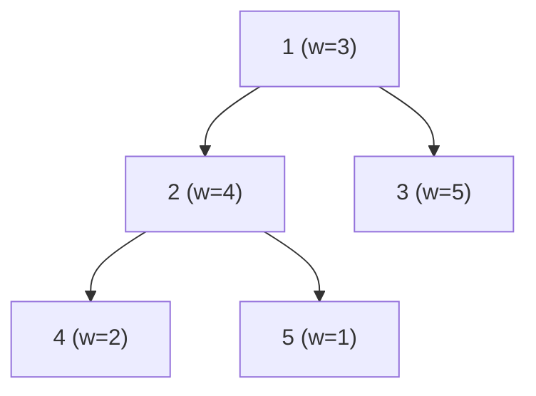
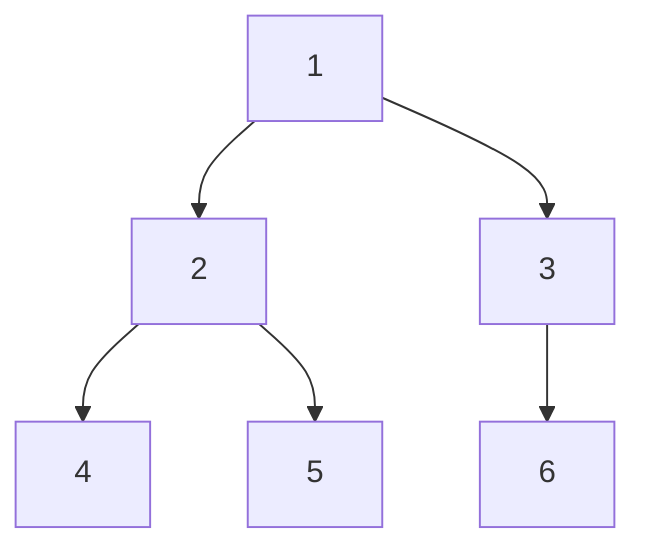

## 木DP とは

木DP は、木構造上で各頂点を根とする部分木の情報をボトムアップに集約する動的計画法のテクニックである。葉から根へ向かって DFS (深さ優先探索) の帰りがけ順で計算する。

木DPが有効な理由は、木が**閉路を持たない**ため、各部分木が独立に扱えることにある。根付き木において、頂点 $v$ を根とする部分木の情報は、$v$ の子の部分木の情報のみから計算できる。この再帰的な構造がDPの適用を可能にする。

### DFS の帰りがけ順で計算する理由

DFS の帰りがけ順とは、ある頂点 $v$ の全ての子孫を処理した後に $v$ を処理する順序である。木DPでは $v$ の値を計算するために子の値が必要なため、子が先に計算されている必要がある。DFS の帰りがけ順はまさにこの依存関係を満たす。



上の木では、4, 5 → 2, 6, 7 → 3 → 1 の順に計算される。

## 問題1: 最大重み独立集合

### 問題

木の各頂点に重み $w_v$ が与えられている。隣接する 2 頂点を同時に選ばないという制約の下で、選んだ頂点の重みの和を最大化する。

### 状態の定義

$dp[v][0]$ を「頂点 $v$ を選ばない場合の、$v$ を根とする部分木の最大重み」、$dp[v][1]$ を「頂点 $v$ を選ぶ場合の最大重み」とする。

### 漸化式

$$
dp[v][0] = \sum_{c \in \text{children}(v)} \max(dp[c][0],\ dp[c][1])
$$

$$
dp[v][1] = w_v + \sum_{c \in \text{children}(v)} dp[c][0]
$$

**直感的な解釈:**

- $v$ を選ばない場合、各子は選んでも選ばなくてもよい → 各子の最適値を採用
- $v$ を選ぶ場合、子は選べない (独立集合の制約) → 各子は「選ばない」場合のみ

### 求める答え

$$
\max(dp[\text{root}][0],\ dp[\text{root}][1])
$$

### 実装

```python title="tree_dp_independent_set.py"
def max_weight_independent_set(adj: list[list[int]], weight: list[int], root: int = 0) -> int:
    n = len(adj)
    dp = [[0, 0] for _ in range(n)]
    visited = [False] * n

    def dfs(v: int):
        visited[v] = True
        dp[v][1] = weight[v]
        for c in adj[v]:
            if visited[c]:
                continue
            dfs(c)
            dp[v][0] += max(dp[c][0], dp[c][1])
            dp[v][1] += dp[c][0]

    dfs(root)
    return max(dp[root][0], dp[root][1])
```

### 計算例



| 頂点 | $dp[v][0]$ (選ばない) | $dp[v][1]$ (選ぶ) |
|------|---------|---------|
| 4 | 0 | 2 |
| 5 | 0 | 1 |
| 2 | $\max(0,2) + \max(0,1) = 3$ | $4 + 0 + 0 = 4$ |
| 3 | 0 | 5 |
| 1 | $\max(3,4) + \max(0,5) = 9$ | $3 + 3 + 0 = 6$ |

答え: $\max(9, 6) = 9$ (頂点 2, 3 を選択: 重み $4 + 5 = 9$)

## 問題2: 木の直径

### 問題

木の**直径** (diameter) とは、任意の2頂点間の最長パスの長さである。

### 状態の定義

各頂点 $v$ について、$v$ を根とする部分木内で $v$ から最も遠い頂点までの距離 $d[v]$ を管理する。さらに、木全体の直径を追跡する。

### 漸化式

$$
d[v] = \max_{c \in \text{children}(v)} (d[c] + 1)
$$

木の直径は、いずれかの頂点 $v$ を経由する最長パスとして求まる。$v$ を通る最長パスは、$v$ の子の部分木のうち最も深い2つを合わせたものである:

$$
\text{diameter} = \max_{v} \left( \text{top1}(v) + \text{top2}(v) \right)
$$

ここで $\text{top1}(v)$, $\text{top2}(v)$ は $v$ の子 $c$ について $d[c] + 1$ の上位2つの値 (子がない場合は 0)。

### 実装

```python title="tree_diameter.py"
def tree_diameter(adj: list[list[int]], root: int = 0) -> int:
    n = len(adj)
    depth = [0] * n
    visited = [False] * n
    diameter = 0

    def dfs(v: int):
        nonlocal diameter
        visited[v] = True
        top1 = 0  # longest path from v through a child
        top2 = 0  # second longest
        for c in adj[v]:
            if visited[c]:
                continue
            dfs(c)
            d = depth[c] + 1
            if d >= top1:
                top2 = top1
                top1 = d
            elif d > top2:
                top2 = d
        depth[v] = top1
        diameter = max(diameter, top1 + top2)

    dfs(root)
    return diameter
```

### 正当性の説明

木の直径パスはある頂点 $v$ を最も高い位置 (LCA) として通る。$v$ を通る最長パスは、$v$ の異なる2つの子の部分木をそれぞれ最も深く降りたものの和である。全頂点についてこれを計算し、最大を取れば直径が求まる。

## 問題3: 木上の最大マッチング

### 問題

木の辺集合から、**端点を共有しない辺の最大集合** (最大マッチング) を求める。

### 状態の定義

$dp[v][0]$: 頂点 $v$ がマッチングに使われない場合の、$v$ を根とする部分木の最大マッチングサイズ

$dp[v][1]$: 頂点 $v$ がマッチングに使われる場合の、$v$ を根とする部分木の最大マッチングサイズ

### 漸化式

$$
dp[v][0] = \sum_{c \in \text{children}(v)} \max(dp[c][0],\ dp[c][1])
$$

$v$ がマッチングに使われない場合、各子は自由にマッチングに参加できる。

$$
dp[v][1] = \max_{c \in \text{children}(v)} \left( dp[c][0] + 1 + \sum_{c' \neq c} \max(dp[c'][0],\ dp[c'][1]) \right)
$$

$v$ がマッチングに使われる場合、ある子 $c$ との辺 $(v, c)$ をマッチングに含める。$c$ はマッチングに使われるので $dp[c][0]$ を使い、辺 $(v,c)$ で +1 する。残りの子は自由。

これを整理すると:

$$
dp[v][1] = dp[v][0] + \max_{c \in \text{children}(v)} \left( dp[c][0] + 1 - \max(dp[c][0],\ dp[c][1]) \right)
$$

### 実装

```python title="tree_matching.py"
def max_matching(adj: list[list[int]], root: int = 0) -> int:
    n = len(adj)
    dp = [[0, 0] for _ in range(n)]
    visited = [False] * n

    def dfs(v: int):
        visited[v] = True
        sum_max = 0
        best_gain = -1  # gain from matching edge (v, c)
        for c in adj[v]:
            if visited[c]:
                continue
            dfs(c)
            mx = max(dp[c][0], dp[c][1])
            sum_max += mx
            # Gain if we match (v, c): dp[c][0] + 1 - max(dp[c][0], dp[c][1])
            gain = dp[c][0] + 1 - mx
            best_gain = max(best_gain, gain)

        dp[v][0] = sum_max
        if best_gain >= 0:
            dp[v][1] = sum_max + best_gain
        else:
            dp[v][1] = sum_max  # no beneficial matching

    dfs(root)
    return max(dp[root][0], dp[root][1])
```

### 計算例



| 頂点 | $dp[v][0]$ | $dp[v][1]$ | 説明 |
|------|---------|---------|------|
| 4 | 0 | 0 | 葉 |
| 5 | 0 | 0 | 葉 |
| 2 | 0 | 1 | 辺(2,4)か(2,5)をマッチ |
| 6 | 0 | 0 | 葉 |
| 3 | 0 | 1 | 辺(3,6)をマッチ |
| 1 | $\max(0,1)+\max(0,1)=2$ | $2 + (0+1-1) = 2$ | |

答え: $\max(2, 2) = 2$ (例: 辺(2,4)と(3,6)をマッチング)

## 問題4: 木の彩色数え上げ

### 問題

木の各頂点を $k$ 色で塗り分ける方法のうち、隣接する頂点が異なる色になるものの数を求める。

### 状態の定義

$dp[v]$: 頂点 $v$ を根とする部分木を正しく塗り分ける方法数 ($v$ にはある特定の色が割り当てられていると仮定)。

### 漸化式

$v$ にある色が割り当てられているとき、各子 $c$ は残り $k - 1$ 色から選べる:

$$
dp[v] = \prod_{c \in \text{children}(v)} (k - 1) \cdot dp[c]
$$

ただし $dp[v]$ は「$v$ にある1色を固定した場合」の方法数。根について $k$ 色の選択肢があるため:

$$
\text{答え} = k \cdot dp[\text{root}]
$$

実はこれを展開すると、木の彩色多項式 $P(k) = k \cdot (k-1)^{n-1}$ に一致する。木は必ず $(k-1)^{n-1}$ 通りに塗り分けられる ($k \geq 2$ のとき)。

### 実装

```python title="tree_coloring.py"
def count_colorings(adj: list[list[int]], k: int, root: int = 0) -> int:
    n = len(adj)
    dp = [1] * n
    visited = [False] * n

    def dfs(v: int):
        visited[v] = True
        for c in adj[v]:
            if visited[c]:
                continue
            dfs(c)
            dp[v] *= (k - 1) * dp[c]

    dfs(root)
    return k * dp[root]
```

## 一般的な設計パターン

### 複数状態のDP

多くの木DPの問題は $dp[v][\text{state}]$ の形をとる。$\text{state}$ は頂点 $v$ の状態を表す。

| 問題 | 状態 | 遷移 |
|------|------|------|
| 最大重み独立集合 | $\{0: \text{選ばない}, 1: \text{選ぶ}\}$ | 子の状態に応じて加算 |
| 最大マッチング | $\{0: \text{未使用}, 1: \text{使用}\}$ | マッチ辺の選択 |
| 彩色 | 色番号 $\{1, \ldots, k\}$ | 隣接色の排除 |
| 部分木のサイズ | なし (単一値) | $dp[v] = 1 + \sum dp[c]$ |

### 実装テンプレート

木DPの一般的な実装パターンは以下の通り:

```python title="tree_dp_template.py"
def tree_dp(adj: list[list[int]], root: int = 0):
    n = len(adj)
    dp = [initial_value() for _ in range(n)]
    visited = [False] * n

    def dfs(v: int):
        visited[v] = True
        # Initialize dp[v] (leaf case)
        base_case(dp, v)
        for c in adj[v]:
            if visited[c]:
                continue
            dfs(c)
            # Merge child's result into parent
            merge(dp, v, c)

    dfs(root)
    return extract_answer(dp, root)
```

ポイント:
- `base_case`: 葉の場合の初期化
- `merge`: 子の結果を親に統合する操作
- `extract_answer`: 根の値から最終的な答えを取り出す

### スタックによる非再帰実装

木の頂点数が大きい場合 ($n > 10^5$ 程度)、再帰の深さ制限に引っかかることがある。この場合、DFS を明示的なスタックで実装する。

```python title="tree_dp_iterative.py"
def tree_dp_iterative(adj: list[list[int]], root: int = 0):
    n = len(adj)
    dp = [[0, 0] for _ in range(n)]
    parent = [-1] * n
    order = []  # topological order (post-order)

    # BFS to determine order and parent
    from collections import deque
    visited = [False] * n
    queue = deque([root])
    visited[root] = True
    while queue:
        v = queue.popleft()
        order.append(v)
        for c in adj[v]:
            if not visited[c]:
                visited[c] = True
                parent[c] = v
                queue.append(c)

    # Process in reverse BFS order (children before parents)
    for v in reversed(order):
        dp[v][1] = 1  # weight[v] for independent set
        for c in adj[v]:
            if c == parent[v]:
                continue
            dp[v][0] += max(dp[c][0], dp[c][1])
            dp[v][1] += dp[c][0]

    return max(dp[root][0], dp[root][1])
```

## 計算量

### 命題: 木DPは $O(n \cdot S)$ で計算できる

ここで $S$ は状態数、$n$ は頂点数である。

**証明:**

DFS で各頂点を 1 回ずつ訪問する。各頂点での処理は子の数に比例するので、全体では辺の数に比例する。木の辺数は $n - 1$ なので、各辺について $O(S)$ の状態遷移を行うと、時間計算量は $O(n \cdot S)$ である。 $\square$

上で扱った問題では $S = O(1)$ なので、いずれも $O(n)$ で計算できる。

## 発展: 全方位木DP (再根付け / rerooting)

### 動機

通常の木DPは根を1つ固定して計算する。しかし「全ての頂点を根としたときの答えを求めたい」場合がある。素朴には各頂点を根として $n$ 回DPを行うと $O(n^2)$ かかるが、**全方位木DP** (rerooting technique) を使えば $O(n)$ で全頂点の答えを求められる。

### アイデア

1. まず任意の頂点を根として通常の木DPを行う (1回目のDFS)
2. 根を隣接頂点に「移す」とき、DPの値がどう変わるかを効率的に計算する (2回目のDFS)

根を頂点 $v$ から子 $c$ に移すとき:
- $c$ の部分木の寄与は除く
- $v$ の部分木 ($c$ を除いた分) の寄与を加える

### 適用例

- 各頂点を根としたときの部分木の最大深さ → 全頂点からの最遠点距離
- 各頂点を根としたときの部分木のサイズ和 → 全頂点間距離の総和

全方位木DPについては別記事で詳しく解説する。

## まとめ

| 項目 | 内容 |
|------|------|
| 適用対象 | 木構造上の最適化・数え上げ |
| 時間計算量 | $O(n \cdot S)$ ($S$ は状態数) |
| 空間計算量 | $O(n \cdot S)$ |
| 核心 | DFS の帰りがけ順で部分木の情報を集約 |
| 設計パターン | $dp[v][\text{state}]$、子のマージ操作 |
| 代表問題 | 独立集合、マッチング、直径、彩色 |
| 発展 | 全方位木DP (rerooting) で全頂点の答えを $O(n)$ で |
