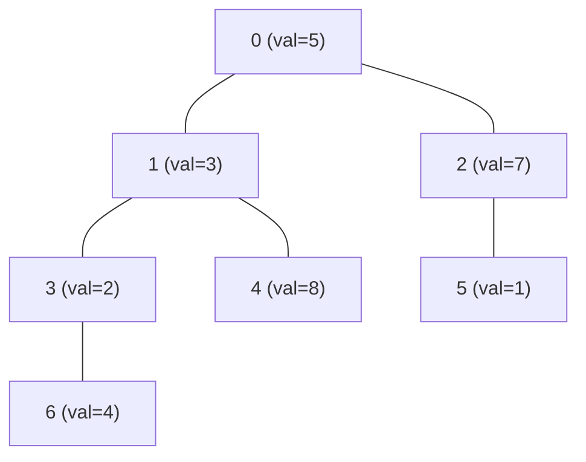

## 木上のパスクエリとは

根付き木において、2つの頂点 $u, v$ を結ぶパス上の頂点 (または辺) に対する集約クエリを効率的に処理する手法の総称である。

### 代表的なクエリ

- **パス上の合計:** $\sum_{w \in \mathrm{path}(u,v)} \mathrm{value}(w)$
- **パス上の最大値/最小値:** $\max_{w \in \mathrm{path}(u,v)} \mathrm{value}(w)$
- **パス上の更新:** パス上の全頂点の値に $x$ を加算
- **パス上の辺の集約:** 辺の重みに対する同様のクエリ

## 素朴なアプローチ

### LCA を経由する方法

$u$ から $v$ へのパスは、LCA $w = \mathrm{LCA}(u, v)$ を経由して $u \to w \to v$ と分解できる。

1. LCA $w$ を求める
2. $u$ から $w$ へ 1 ステップずつ遡りながら値を集約
3. $v$ から $w$ へ 1 ステップずつ遡りながら値を集約
4. 結果を合成

この方法では LCA の計算後にパスの長さに比例する $O(\mathrm{dist}(u, v))$ の時間がかかる。最悪 $O(n)$。

```python title="naive_path_query.py"
def path_sum(u, v, parent, value):
    w = lca(u, v)
    total = 0
    # Climb from u to w
    cur = u
    while cur != w:
        total += value[cur]
        cur = parent[cur]
    total += value[w]
    # Climb from v to w (excluding w)
    cur = v
    while cur != w:
        total += value[cur]
        cur = parent[cur]
    return total
```

## 効率的な手法

### 手法 1: ダブリング + 累積値

ダブリングテーブルに値の集約情報も持たせる方法。

$\mathrm{up}[k][v]$: 頂点 $v$ の $2^k$ 個上の祖先

$\mathrm{sum\_up}[k][v]$: 頂点 $v$ から $2^k$ 個上の祖先までのパスの合計

$$
\mathrm{sum\_up}[k][v] = \mathrm{sum\_up}[k-1][v] + \mathrm{sum\_up}[k-1][\mathrm{up}[k-1][v]]
$$

クエリ処理は LCA ダブリングと同様に $u$ を $v$ を LCA に向かって $2^k$ ずつジャンプさせながら、累積値を足し合わせる。

| 項目 | 計算量 |
|------|--------|
| 前計算 | $O(n \log n)$ |
| クエリ | $O(\log n)$ |
| 更新 | $O(n \log n)$ (テーブル再構築) |

値が不変 (静的) な場合に有効。

### 手法 2: Euler Tour + セグメント木

Euler Tour で木を一次元配列に変換し、セグメント木で区間クエリを処理する。

**部分木クエリ**には直接適用できるが、パスクエリには工夫が必要:

- 根から $v$ までのパスの合計 = $\sum_{w: \text{root→v のパス}} \mathrm{value}(w)$
- パス $(u, v)$ の合計 = (根→$u$ の合計) + (根→$v$ の合計) - 2 * (根→$\mathrm{LCA}$ の合計) + $\mathrm{value}(\mathrm{LCA})$

### 手法 3: Heavy-Light Decomposition + セグメント木

最も汎用的な手法。HL分解で木をチェーンに分解し、各チェーン上のクエリをセグメント木で処理する。

```python title="hld_path_query.py"
def path_query(u, v):
    result = 0  # identity for sum
    while chain_head[u] != chain_head[v]:
        if depth[chain_head[u]] < depth[chain_head[v]]:
            u, v = v, u
        # Query the segment [pos[chain_head[u]], pos[u]]
        result += seg.query(pos[chain_head[u]], pos[u])
        u = parent[chain_head[u]]
    # Same chain
    if depth[u] > depth[v]:
        u, v = v, u
    result += seg.query(pos[u], pos[v])
    return result
```

| 項目 | 計算量 |
|------|--------|
| 前計算 | $O(n)$ |
| クエリ | $O(\log^2 n)$ |
| 1点更新 | $O(\log n)$ |
| パス更新 | $O(\log^2 n)$ |

### 手法 4: Link-Cut Tree

動的な木 (辺の追加・削除がある場合) ではLink-Cut Tree を使用する。

| 項目 | 計算量 |
|------|--------|
| クエリ | 償却 $O(\log n)$ |
| 更新 | 償却 $O(\log n)$ |
| link/cut | 償却 $O(\log n)$ |

## 各手法の比較

| 手法 | 前計算 | クエリ | 更新 | 動的 | 実装の容易さ |
|------|--------|--------|------|------|-------------|
| ダブリング + 累積 | $O(n \log n)$ | $O(\log n)$ | $O(n \log n)$ | No | 簡単 |
| Euler Tour + 差分 | $O(n)$ | $O(\log n)$ | $O(\log n)$ | No | 中程度 |
| HL分解 + セグ木 | $O(n)$ | $O(\log^2 n)$ | $O(\log^2 n)$ | No | 中程度 |
| Link-Cut Tree | $O(n)$ | $O(\log n)$ 償却 | $O(\log n)$ 償却 | Yes | 難しい |

## パスクエリの帰着: 頂点 vs 辺

### 頂点クエリ

各頂点に値がある場合、上記の手法がそのまま適用できる。LCA の値は 1 回だけ加算するよう注意する。

### 辺クエリ

辺に値がある場合、辺の値を深い方の端点に移す (辺 $(u, v)$ で $u$ が親なら $v$ に値を持たせる) ことで頂点クエリに帰着できる。

ただし LCA 自身は辺を代表しないため、クエリ時に LCA の頂点を除外する:

```python
def edge_path_query(u, v):
    w = lca(u, v)
    return vertex_path_query(u, v) - value[w]
```

## 具体例



$\mathrm{path\_sum}(6, 4)$:
- LCA(6, 4) = 1
- パス: 6 → 3 → 1 → 4
- 合計 = 4 + 2 + 3 + 8 = 17

$\mathrm{path\_max}(6, 5)$:
- LCA(6, 5) = 0
- パス: 6 → 3 → 1 → 0 → 2 → 5
- 最大値 = max(4, 2, 3, 5, 7, 1) = 7

## まとめ

| 項目 | 内容 |
|------|------|
| 問題 | 木上の 2 頂点間パスに対する集約クエリ |
| 核心 | LCA でパスを分解し、適切なデータ構造で効率化 |
| 静的・クエリのみ | ダブリング + 累積値 ($O(\log n)$ クエリ) |
| 静的・更新あり | HL分解 + セグメント木 ($O(\log^2 n)$) |
| 動的 (辺の追加削除) | Link-Cut Tree ($O(\log n)$ 償却) |
