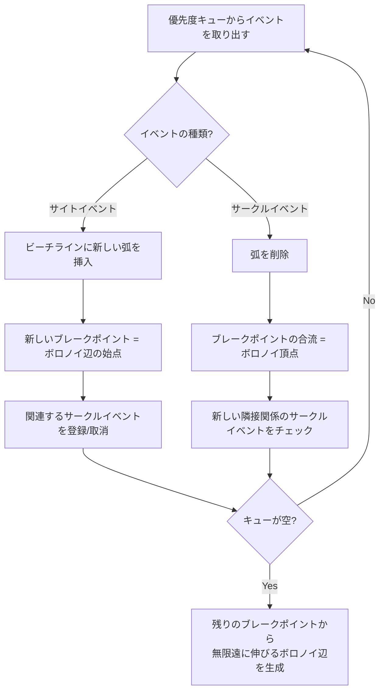

## ボロノイ図とは

平面上に $n$ 個の点 (母点、サイト) $S = \{s_1, s_2, \ldots, s_n\}$ が与えられたとき、各母点 $s_i$ に対して「$s_i$ に最も近い点の集合」を定める空間分割を **ボロノイ図 (Voronoi Diagram)** と呼ぶ。

ボロノイ図は計算幾何の中で最も重要なデータ構造の一つであり、自然界の多くの現象 (結晶構造、細胞分裂、動物のテリトリー) をモデル化する。

### 定義

母点 $s_i$ の **ボロノイ領域 (Voronoi cell)** は:

$$
V(s_i) = \{x \in \mathbb{R}^2 \mid \|x - s_i\| \leq \|x - s_j\| \text{ for all } j \neq i\}
$$

ボロノイ領域の境界を **ボロノイ辺**、3つ以上のボロノイ領域が交わる点を **ボロノイ頂点** と呼ぶ。

### 基本的な性質

- 各ボロノイ領域は凸多角形 (無限領域の場合もある)
- ボロノイ辺は2つの母点の垂直二等分線の一部
- ボロノイ頂点は3つの母点から等距離にある点
- ボロノイ図の辺の数は $O(n)$、頂点の数も $O(n)$

### なぜ各性質が成り立つか

**凸性:** $V(s_i) = \bigcap_{j \neq i} \{x \mid \|x - s_i\| \leq \|x - s_j\|\}$ と書ける。各 $\{x \mid \|x - s_i\| \leq \|x - s_j\|\}$ は半平面であり、半平面の交差は凸集合である。したがって各ボロノイ領域は凸。

**垂直二等分線:** 2点 $s_i$, $s_j$ から等距離にある点の集合は $s_i s_j$ の垂直二等分線である。ボロノイ辺はこの垂直二等分線の一部分にあたる。

**サイズの上界:** オイラーの公式 $V - E + F = 2$ (ここで $F$ は領域数 $n$ を含む) と、各辺が2つの領域を分けることから、辺の数は高々 $3n - 6$、頂点の数は高々 $2n - 5$ である。

## ボロノイ図の構築: 半平面交差による方法

定義から直接的に構築する方法として、各母点のボロノイ領域を半平面交差として計算する方法がある。

$V(s_i)$ は $n - 1$ 個の半平面の交差であるから、1領域あたり $O(n \log n)$ で計算でき、全体で $O(n^2 \log n)$ かかる。この方法は非効率だが、ボロノイ図の構造を理解する上で有益である。

## Fortune's Algorithm (スイープライン法)

Fortune's Algorithm は $O(n \log n)$ でボロノイ図を構築するスイープラインアルゴリズムである。1987 年に Steven Fortune によって提案された。

### スイープラインの概念

水平な走査線 (sweep line) を上から下へ動かしながら、走査線より上側のボロノイ図を逐次的に構築する。

通常のスイープライン法では、走査線上の情報だけで図を構築するが、ボロノイ図の場合、走査線の下に未発見の母点があるため、走査線上のボロノイ辺は確定しない。Fortune のアイデアは **ビーチライン** という補助構造を導入することでこの問題を解決する。

### ビーチライン (Beach Line)

**ビーチライン** とは、各母点と走査線から等距離にある点の軌跡 (= 放物線) の下側包絡線である。

母点 $s_i$ と走査線 $\ell$ (高さ $y = d$) から等距離にある点の集合は、$s_i$ を焦点、$\ell$ を準線とする放物線である。走査線がまだ通過していない母点は走査線より下にあるため、走査線からの距離はビーチラインからの距離以上になる。

したがって、ビーチライン上の点 $p$ については:

$$
d(p, \text{最近傍の既知母点}) = d(p, \text{走査線})
$$

が成り立つ。ビーチラインより上側の領域では、最近傍母点が確定している。

### ビーチラインの構造

ビーチラインは複数の放物線の弧が連なった形をしている。隣接する2つの弧の交点 (= **ブレークポイント**) は、対応する2つの母点の垂直二等分線上を移動する。つまり、ブレークポイントの軌跡がボロノイ辺になる。

### イベントの種類

Fortune's Algorithm は2種類のイベントを処理する。

**1. サイトイベント (Site Event)**

走査線が新しい母点 $s_i$ に到達したとき発生する。

処理:
1. ビーチラインで $s_i$ の直上にある弧 $\alpha$ を見つける
2. 弧 $\alpha$ を3つに分割する: $\alpha$ の左部分、$s_i$ による新しい弧、$\alpha$ の右部分
3. 2つの新しいブレークポイントはボロノイ辺の始点になる
4. 消滅する可能性のある弧についてサークルイベントをチェックする

**2. サークルイベント (Circle Event)**

ビーチラインの弧 $\beta$ が消滅するとき発生する。3つの連続する弧 $\alpha$, $\beta$, $\gamma$ に対応する母点が作る円の最下点が走査線に到達したときに起こる。

処理:
1. 弧 $\beta$ を除去する
2. 左右のブレークポイントが合流し、ボロノイ頂点 (3母点の外接円の中心) が確定する
3. 新しい隣接弧の組み合わせについてサークルイベントをチェックする

### イベント処理の流れ



### データ構造

- **優先度キュー:** イベントを y 座標 (走査線の位置) で管理。サイトイベントとサークルイベントの両方を格納する
- **ビーチライン:** 平衡二分探索木で管理する。葉が弧 (母点に対応)、内部ノードがブレークポイント (2つの母点のペアに対応) を表す
- **DCEL (Doubly Connected Edge List):** ボロノイ図の辺と頂点を格納するデータ構造

### 擬似コード

```python title="fortune_pseudo.py"
def fortune_voronoi(sites):
    # Initialize priority queue with site events
    pq = PriorityQueue()
    for s in sites:
        pq.push(SiteEvent(s))

    beach_line = BalancedBST()

    while not pq.empty():
        event = pq.pop()
        if isinstance(event, SiteEvent):
            handle_site_event(event, beach_line, pq)
        else:
            handle_circle_event(event, beach_line, pq)

    return extract_voronoi_edges(beach_line)
```

### 計算量の解析

- イベントの総数: サイトイベントは $n$ 個。サークルイベントは最大 $O(n)$ 個 (各弧の消滅は高々1回)
- 各イベントの処理: 平衡二分探索木と優先度キューの操作により $O(\log n)$
- **全体:** $O(n \log n)$ 時間、$O(n)$ 空間

## 分割統治法

点集合を左右に分割し、それぞれのボロノイ図を再帰的に構築してからマージする。計算量は $O(n \log n)$ だが、実装は Fortune's Algorithm より複雑である。

### マージ手順

左右のボロノイ図をマージするには、**マージ曲線** (左右の母点集合の垂直二等分線の連鎖) を計算する必要がある。

1. 上端から始めて、マージ曲線を上から下にトレースする
2. マージ曲線が左側のボロノイ辺と交差したら、左側の辺を切断する
3. マージ曲線が右側のボロノイ辺と交差したら、右側の辺を切断する
4. 下端に到達するまで繰り返す

マージ曲線は $y$ 座標について単調であり、$O(n)$ 時間でトレースできる。

## ドロネー三角形分割との双対性

ボロノイ図とドロネー三角形分割は **双対 (dual)** の関係にある。この双対性は計算幾何で最も美しい対応関係の一つである。

### 対応関係の詳細

| ボロノイ図 | ドロネー三角形分割 |
|-----------|------------------|
| ボロノイ頂点 | ドロネー三角形 (頂点は外接円の中心) |
| ボロノイ辺 | ドロネー辺 (辺に直交する) |
| ボロノイ領域 | ドロネー頂点 (母点) |
| 隣接するボロノイ領域 | ドロネー辺で結ばれた2頂点 |
| 次数 $k$ のボロノイ頂点 | $k$ 個の三角形が共有する頂点 |

### 双対性の直感

2つの母点 $s_i$, $s_j$ のボロノイ領域が辺を共有するということは、$s_i$ と $s_j$ の垂直二等分線上に他の母点より $s_i$, $s_j$ に近い点が存在するということである。これは $s_i$ と $s_j$ を結ぶ辺がドロネー辺であることと同値である (空円条件から)。

ボロノイ頂点は3つの母点から等距離にある点であり、その3点の外接円の中心である。この外接円の内部に他の母点が存在しないため、3点はドロネー三角形を形成する。

### 実用的な意味

- ドロネー三角形分割からボロノイ図を構築: 各ドロネー三角形の外接円の中心を求め、隣接する三角形の中心同士を辺で結ぶ
- ボロノイ図からドロネー三角形分割を構築: 辺を共有するボロノイ領域の母点同士を辺で結ぶ

どちらの変換も $O(n)$ で実行可能である。

## 応用

### 最近傍探索

ボロノイ図を前処理として構築しておくと、任意のクエリ点 $q$ に対して最近傍の母点を効率的に見つけられる。$q$ がどのボロノイ領域に属するかを点位置特定 (point location) で $O(\log n)$ で決定すれば、そのセルの母点が最近傍である。

### 施設配置問題

$n$ 個の既存施設がある状況で新しい施設を配置する場合、最も「孤立した」点 (最も近い既存施設からの距離が最大になる点) を求めたいことがある。この点はボロノイ頂点またはボロノイ辺上にあることが保証される。

### その他の応用

- 自然科学でのセル構造のモデリング (結晶学、生物学)
- ロボティクスの経路計画 (ボロノイ辺に沿って移動すると障害物から最も離れた経路になる)
- 地理情報システム (GIS) での勢力圏分析
- 衝突検出・近接クエリ

## 計算量

| 手法 | 時間計算量 | 空間計算量 |
|------|-----------|-----------|
| Fortune's Algorithm | $O(n \log n)$ | $O(n)$ |
| 分割統治 | $O(n \log n)$ | $O(n)$ |
| 半平面交差 (各領域ごと) | $O(n^2 \log n)$ | $O(n)$ |
| 逐次挿入 | $O(n^2)$ 最悪 | $O(n)$ |

なお、$\Omega(n \log n)$ の下界は、ソートからの帰着により証明される ($n$ 個の実数 $x_1, \ldots, x_n$ を点 $(x_i, 0)$ としてボロノイ図を構築すると、ボロノイ辺からソート結果が得られる)。

## まとめ

| 項目 | 内容 |
|------|------|
| 入力 | 平面上の $n$ 個の母点 |
| 出力 | ボロノイ図 (辺と頂点) |
| 最適計算量 | $O(n \log n)$ |
| 空間計算量 | $O(n)$ |
| 核心 | 各母点に最も近い領域の分割 |
| 双対 | ドロネー三角形分割と双対関係 |
