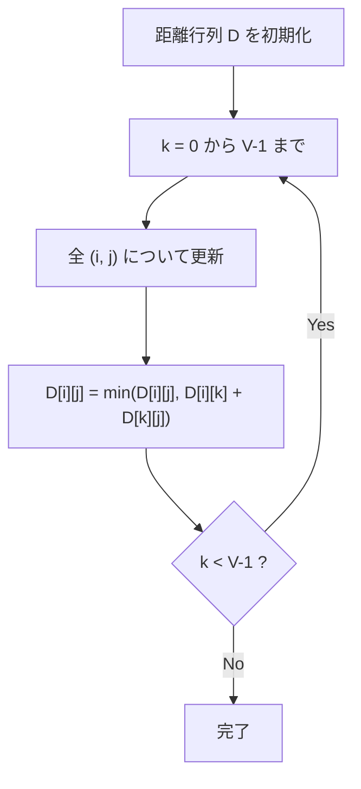

## Warshall-Floyd法とは

**Warshall-Floyd法** (ワーシャル-フロイド法、Floyd-Warshall法とも呼ばれる) は、重み付きグラフにおいて**全頂点対間の最短距離**を $O(V^3)$ で求めるアルゴリズムである。

動的計画法に基づき、中継頂点を 1 つずつ増やしながら最短距離を更新していく。

### 問題設定

重み付きグラフ $G = (V, E, w)$ が与えられたとき、全ての頂点対 $(i, j)$ について最短距離 $\delta(i, j)$ を求める。

## アルゴリズムの動作

### 動的計画法の定義

$d_k[i][j]$ を「頂点 $\{0, 1, \ldots, k-1\}$ のみを中継頂点として使える場合の $i$ から $j$ への最短距離」とする。

初期状態 ($k = 0$):

$$
d_0[i][j] = \begin{cases}
0 & \text{if } i = j \\
w(i, j) & \text{if } (i, j) \in E \\
\infty & \text{otherwise}
\end{cases}
$$

遷移 ($k \geq 1$):

$$
d_k[i][j] = \min(d_{k-1}[i][j],\ d_{k-1}[i][k-1] + d_{k-1}[k-1][j])
$$

### 直感的な理解

頂点 $k$ を中継点として使うか使わないかの 2 択:

- **使わない場合**: 距離は $d_{k-1}[i][j]$ のまま
- **使う場合**: $i \to k \to j$ と経由するので、距離は $d_{k-1}[i][k] + d_{k-1}[k][j]$

これらの小さい方が $d_k[i][j]$ になる。



## 実装

```python title="warshall_floyd.py"
def warshall_floyd(n: int, edges: list[tuple[int, int, int]]) -> list[list[float]]:
    INF = float('inf')
    dist = [[INF] * n for _ in range(n)]

    # Initialize
    for i in range(n):
        dist[i][i] = 0
    for u, v, w in edges:
        dist[u][v] = min(dist[u][v], w)

    # DP
    for k in range(n):
        for i in range(n):
            for j in range(n):
                if dist[i][k] + dist[k][j] < dist[i][j]:
                    dist[i][j] = dist[i][k] + dist[k][j]

    return dist
```

### in-place 更新が正しい理由

添字 $k$ の次元を省略して in-place で更新しても正しい。$d[i][k]$ と $d[k][j]$ は中継頂点 $k$ を含むかどうかに関わらず値が変わらないためである。

具体的には、$d_k[i][k] = d_{k-1}[i][k]$ かつ $d_k[k][j] = d_{k-1}[k][j]$ が成り立つ。なぜなら $d_k[i][k] = \min(d_{k-1}[i][k], d_{k-1}[i][k] + d_{k-1}[k][k])$ であり、$d_{k-1}[k][k] \geq 0$ (負の閉路がない場合) なので第 1 項が最小。

## 正当性の証明

### 命題: Warshall-Floyd法は全頂点対間の最短距離を正しく計算する

**証明:**

$d_k[i][j]$ の定義に関する帰納法。

**基底 ($k = 0$):** 中継頂点を使わない場合、直接辺の重みまたは $\infty$ であり、正しい。

**帰納段階:** $d_{k-1}$ が正しいと仮定する。$i$ から $j$ へ頂点 $\{0, \ldots, k\}$ のみを中継する最短パスを考える:

- 頂点 $k$ を通らない場合: 距離は $d_{k-1}[i][j]$
- 頂点 $k$ を通る場合: $i \to \cdots \to k \to \cdots \to j$ と分割でき、$i$ から $k$ と $k$ から $j$ のパスはそれぞれ頂点 $\{0, \ldots, k-1\}$ のみを中継する。距離は $d_{k-1}[i][k] + d_{k-1}[k][j]$

$$
d_k[i][j] = \min(d_{k-1}[i][j], d_{k-1}[i][k] + d_{k-1}[k][j])
$$

$k = V$ のとき、全頂点を中継に使えるので $d_V[i][j] = \delta(i, j)$。 $\square$

## 計算量

| 項目 | 計算量 |
|------|--------|
| 時間計算量 | $O(V^3)$ |
| 空間計算量 | $O(V^2)$ |

三重ループのため $O(V^3)$。距離行列の格納に $O(V^2)$。

## 負の閉路の検出

アルゴリズム完了後、$d[i][i] < 0$ なる頂点 $i$ が存在すれば、負の閉路が存在する。

## 経路の復元

各頂点対について「最後に更新した中継頂点」を記録すれば、最短パスを復元できる。

```python title="warshall_floyd_path.py"
def warshall_floyd_with_path(n: int, edges: list[tuple[int, int, int]]):
    INF = float('inf')
    dist = [[INF] * n for _ in range(n)]
    nxt = [[-1] * n for _ in range(n)]

    for i in range(n):
        dist[i][i] = 0
    for u, v, w in edges:
        if w < dist[u][v]:
            dist[u][v] = w
            nxt[u][v] = v

    for k in range(n):
        for i in range(n):
            for j in range(n):
                if dist[i][k] + dist[k][j] < dist[i][j]:
                    dist[i][j] = dist[i][k] + dist[k][j]
                    nxt[i][j] = nxt[i][k]

    return dist, nxt
```

## 応用

### 推移閉包

重みを考えず、到達可能性のみを判定する場合は Warshall のアルゴリズム (Warshall-Floyd の特殊ケース) になる。

### グラフの直径

全頂点対間の最短距離の最大値がグラフの直径である。

## まとめ

| 項目 | 内容 |
|------|------|
| 入力 | 重み付きグラフ $G = (V, E, w)$ |
| 出力 | 全頂点対間の最短距離行列 |
| 時間計算量 | $O(V^3)$ |
| 空間計算量 | $O(V^2)$ |
| 核心 | 中継頂点を 1 つずつ追加する DP |
| 応用 | 全点対最短路、推移閉包、グラフ直径 など |
