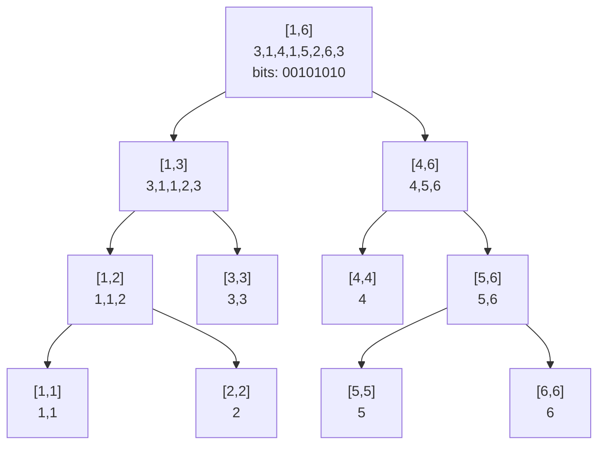

## Wavelet Tree とは

Wavelet Tree は、数列に対する多様なクエリを効率的に処理するデータ構造である。値域 $[lo, hi]$ のアルファベット上の列 $S$ を、二分木構造で再帰的に分割して管理する。

### 対応するクエリ

Wavelet Tree は以下のようなクエリを $O(\log \sigma)$ で処理できる ($\sigma$ は値域のサイズ):

- **rank**: 区間 $[l, r]$ に値 $c$ が何回出現するか
- **select**: $k$ 番目の $c$ の出現位置
- **kth smallest**: 区間 $[l, r]$ の $k$ 番目に小さい要素
- **range count**: 区間 $[l, r]$ で $[a, b]$ に含まれる要素数

### 計算量

| 操作 | 時間計算量 |
|------|-----------|
| 構築 | $O(n \log \sigma)$ |
| rank / kth / select | $O(\log \sigma)$ |
| 空間計算量 | $O(n \log \sigma)$ |

## 構造

### 構築の概要

値域 $[lo, hi]$ の列 $S$ に対して:

1. $lo = hi$ なら葉ノード (全要素が同じ値)
2. そうでなければ、中央値 $\text{mid} = \lfloor (lo + hi) / 2 \rfloor$ で分割:
   - 値 $\leq \text{mid}$ の要素を**左の子**に送る (ビット 0)
   - 値 $> \text{mid}$ の要素を**右の子**に送る (ビット 1)
   - 各要素にビット (0 or 1) を割り当て、ビットの接頭辞和を保持する

### 例

列 $[3, 1, 4, 1, 5, 2, 6, 3]$、値域 $[1, 6]$:

根ノード: mid = 3
- ビット列: $[0, 0, 1, 0, 1, 0, 1, 0]$ (値 $\leq 3$ は 0, 値 $> 3$ は 1)
- 左の子: $[3, 1, 1, 2, 3]$ (値域 $[1, 3]$)
- 右の子: $[4, 5, 6]$ (値域 $[4, 6]$)



## K 番目に小さい要素

### アルゴリズム

区間 $[l, r]$ の $k$ 番目に小さい要素を求めるクエリは、木を根から葉まで辿ることで答えられる。

各ノードで:
1. $[l, r]$ の要素のうち、左の子に行く要素数 $c_0$ を計算 (ビット 0 の個数)
2. $k \leq c_0$ なら左の子に進む ($k$ はそのまま)
3. $k > c_0$ なら右の子に進む ($k \leftarrow k - c_0$)

左の子に進むとき、区間 $[l, r]$ は左の子の座標系に変換する必要がある:
- $l' = \text{leftCount}[l]$ (位置 $l$ より前に左に行った要素数)
- $r' = \text{leftCount}[r+1] - 1$

右の子に進む場合も同様に変換する。

```python title="wavelet_kth.py"
def kth_smallest(node, l, r, k):
    if node.lo == node.hi:
        return node.lo
    left_in_range = node.left_count[r + 1] - node.left_count[l]
    if k <= left_in_range:
        new_l = node.left_count[l]
        new_r = node.left_count[r + 1] - 1
        return kth_smallest(node.left, new_l, new_r, k)
    else:
        right_before_l = l - node.left_count[l]
        right_in_range = (r - l + 1) - left_in_range
        new_l = right_before_l
        new_r = right_before_l + right_in_range - 1
        return kth_smallest(node.right, new_l, new_r, k - left_in_range)
```

## Rank クエリ

区間 $[l, r]$ で値 $c$ が何回出現するかを数える。

木を根から辿り、$c \leq \text{mid}$ なら左に、そうでなければ右に進む。各ステップで区間を適切に変換し、葉に到達したときの区間の長さが出現回数になる。

## 完全な実装

```python title="wavelet_tree.py"
class WaveletNode:
    def __init__(self, lo, hi, seq):
        self.lo = lo
        self.hi = hi
        self.left = None
        self.right = None

        if lo == hi:
            self.left_count = list(range(len(seq) + 1))
            return

        mid = (lo + hi) // 2
        self.bits = [0 if v <= mid else 1 for v in seq]
        # Prefix count of 0-bits
        self.left_count = [0]
        for b in self.bits:
            self.left_count.append(self.left_count[-1] + (1 - b))

        left_seq = [v for v in seq if v <= mid]
        right_seq = [v for v in seq if v > mid]

        if left_seq:
            self.left = WaveletNode(lo, mid, left_seq)
        if right_seq:
            self.right = WaveletNode(mid + 1, hi, right_seq)

    def kth_smallest(self, l, r, k):
        if self.lo == self.hi:
            return self.lo
        left_in_range = self.left_count[r + 1] - self.left_count[l]
        if k <= left_in_range:
            new_l = self.left_count[l]
            new_r = self.left_count[r + 1] - 1
            return self.left.kth_smallest(new_l, new_r, k)
        else:
            right_before = l - self.left_count[l]
            right_in = (r - l + 1) - left_in_range
            return self.right.kth_smallest(
                right_before, right_before + right_in - 1,
                k - left_in_range
            )

    def count_le(self, l, r, x):
        """Count elements <= x in [l, r]"""
        if self.lo == self.hi:
            return r - l + 1 if self.lo <= x else 0
        if x >= self.hi:
            return r - l + 1
        if x < self.lo:
            return 0
        mid = (self.lo + self.hi) // 2
        left_in = self.left_count[r + 1] - self.left_count[l]
        if x <= mid:
            new_l = self.left_count[l]
            new_r = self.left_count[r + 1] - 1
            if new_l > new_r:
                return 0
            return self.left.count_le(new_l, new_r, x)
        else:
            result = left_in  # all left elements are <= mid <= x
            right_before = l - self.left_count[l]
            right_in = (r - l + 1) - left_in
            if right_in > 0:
                result += self.right.count_le(
                    right_before, right_before + right_in - 1, x
                )
            return result
```

## Merge Sort Tree との比較

| 特性 | Wavelet Tree | Merge Sort Tree |
|------|-------------|-----------------|
| 構築 | $O(n \log \sigma)$ | $O(n \log n)$ |
| kth smallest | $O(\log \sigma)$ | $O(\log^3 n)$ |
| rank | $O(\log \sigma)$ | $O(\log^2 n)$ |
| 空間 | $O(n \log \sigma)$ | $O(n \log n)$ |
| 更新 | 不可 (静的) | 不可 (静的) |

Wavelet Tree はクエリが高速だが、$\sigma$ が大きい場合はビット表現を使った実装が必要になる。

## まとめ

| 項目 | 内容 |
|------|------|
| 構築 | $O(n \log \sigma)$ |
| クエリ | $O(\log \sigma)$ |
| 空間 | $O(n \log \sigma)$ |
| 核心 | 値域の二分割による再帰的な列の分類 |
| 利点 | 多様なクエリに統一的に対応 |
| 応用 | kth smallest、rank、range counting、quantile |
