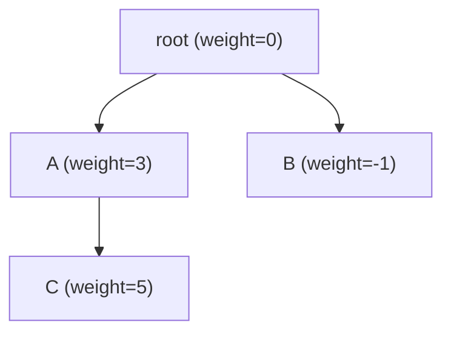

## 重み付き Union-Find とは

重み付き Union-Find (Weighted Union-Find, Potentialized Union-Find) は、通常の Union-Find を拡張し、**要素間の相対的な重み (差分/ポテンシャル)** を管理できるようにしたデータ構造である。

通常の Union-Find が「同じ集合かどうか」を管理するのに対し、重み付き Union-Find は「同じ集合に属するとき、2 要素の間にどれだけの差があるか」も管理する。

### 提供する操作

| 操作 | 説明 |
|------|------|
| `relation(x, y, w)` | $\text{weight}(y) - \text{weight}(x) = w$ という関係を追加 |
| `diff(x, y)` | $\text{weight}(y) - \text{weight}(x)$ を返す (同じ集合の場合) |
| `same(x, y)` | $x$ と $y$ が同じ集合かどうかを返す |

## 基本的なアイデア

各要素 $x$ に**ポテンシャル** (重み) $\text{weight}(x)$ を割り当てる。根のポテンシャルを 0 とし、各ノードは親との差分を保持する。



この場合:
- $\text{diff}(R, A) = 3$
- $\text{diff}(R, C) = 5$ (根から C の重み)
- $\text{diff}(A, C) = 5 - 3 = 2$

## 実装

### データ構造

```python title="weighted_union_find.py"
class WeightedUnionFind:
    def __init__(self, n):
        self.parent = list(range(n))
        self.rank = [0] * n
        self.weight = [0] * n  # weight from node to root

    def find(self, x):
        if self.parent[x] == x:
            return x
        root = self.find(self.parent[x])
        # Path compression with weight update
        self.weight[x] += self.weight[self.parent[x]]
        self.parent[x] = root
        return root

    def get_weight(self, x):
        self.find(x)
        return self.weight[x]

    def diff(self, x, y):
        if self.find(x) != self.find(y):
            raise ValueError("Not in the same set")
        return self.get_weight(y) - self.get_weight(x)

    def relation(self, x, y, w):
        """Set weight(y) - weight(x) = w"""
        rx = self.find(x)
        ry = self.find(y)

        if rx == ry:
            # Already in the same set, check consistency
            return self.diff(x, y) == w

        # Calculate the weight for merging
        wx = self.get_weight(x)
        wy = self.get_weight(y)

        if self.rank[rx] < self.rank[ry]:
            self.parent[rx] = ry
            self.weight[rx] = wy - w - wx
        elif self.rank[rx] > self.rank[ry]:
            self.parent[ry] = rx
            self.weight[ry] = wx + w - wy
        else:
            self.parent[ry] = rx
            self.weight[ry] = wx + w - wy
            self.rank[rx] += 1
        return True

    def same(self, x, y):
        return self.find(x) == self.find(y)
```

### 経路圧縮時の重み更新

通常の Union-Find と同様に経路圧縮を行うが、パスを縮める際に重みも累積する。

`find(x)` を再帰的に呼ぶと、`x` → `parent[x]` → ... → `root` のパスを辿る。帰りがけに各ノードの重みを親の重みに加算し、親を直接根に付け替える。

$$
\text{weight}(x)_{\text{new}} = \text{weight}(x) + \text{weight}(\text{parent}(x))
$$

### relation 時の重み計算

$x$ と $y$ が異なる集合に属するとき、$\text{weight}(y) - \text{weight}(x) = w$ を満たすように統合する。

根 $r_x$ を $r_y$ の下に接続する場合:

$$
\text{weight}(r_x)_{\text{new}} = \text{weight}(y) - w - \text{weight}(x)
$$

これは以下の等式から導かれる:

- $\text{weight}(x) + \text{weight}(r_x)_{\text{new}} + 0 = \text{weight}(y) - w$
- 統合後に $\text{diff}(x, y) = w$ が成り立つ条件

## 計算量

| 操作 | 償却計算量 |
|------|------------|
| `find(x)` | $O(\alpha(n))$ |
| `relation(x, y, w)` | $O(\alpha(n))$ |
| `diff(x, y)` | $O(\alpha(n))$ |
| `same(x, y)` | $O(\alpha(n))$ |

通常の Union-Find と同じく、経路圧縮と union by rank を組み合わせることで $O(\alpha(n))$ を達成する。

## 正当性の証明

### 命題: 経路圧縮後も重みの整合性が保たれる

**証明:**

経路圧縮前に、ノード $x$ から根 $r$ への経路が $x = v_0, v_1, \ldots, v_k = r$ であるとする。

根からの重みは:

$$
\text{weight}(x) = \sum_{i=0}^{k-1} \text{weight}_{edge}(v_i, v_{i+1})
$$

経路圧縮後は $x$ の親が直接 $r$ になり、$\text{weight}(x)$ に親の重みが累積的に加算される。再帰的に処理することで、最終的に $\text{weight}(x)$ は根からの重みの総和になる。

したがって、$\text{diff}(x, y) = \text{weight}(y) - \text{weight}(x)$ の値は経路圧縮の前後で不変である。 $\square$

## 応用

### 差分制約システム

「$y - x = w$」のような制約を複数与えられたとき、矛盾がないかを判定し、矛盾がなければ各変数の値を求める問題。

### 天秤問題

$n$ 個の重りがあり、「重り $a$ は重り $b$ より $w$ グラム重い」という情報が与えられる。2 つの重りの重さの差を求めたり、矛盾を検出する。

### グリッド上の距離管理

2 次元グリッド上の点の相対位置を管理する問題 (例: ABC087D - People on a Line)。

### 群論的な一般化

重みの型を加法群から任意の群に拡張できる。例えば、$\mathbb{Z}/n\mathbb{Z}$ (剰余群) を使えば周期的な制約を扱える。

## 通常の Union-Find との比較

| 機能 | Union-Find | 重み付き Union-Find |
|------|------------|---------------------|
| 同じ集合の判定 | $O(\alpha(n))$ | $O(\alpha(n))$ |
| 集合の統合 | $O(\alpha(n))$ | $O(\alpha(n))$ |
| 要素間の差分 | 不可 | $O(\alpha(n))$ |
| 矛盾の検出 | 不可 | $O(\alpha(n))$ |
| 空間計算量 | $O(n)$ | $O(n)$ |

## まとめ

| 項目 | 内容 |
|------|------|
| データ構造 | 重み付き Union-Find |
| 基本操作 | relation, diff, same |
| 償却計算量 | $O(\alpha(n)) \approx O(1)$ |
| 空間計算量 | $O(n)$ |
| 拡張元 | Union-Find に要素間の重み (ポテンシャル) を追加 |
| 主な応用 | 差分制約、天秤問題、グリッド上の距離管理 |
