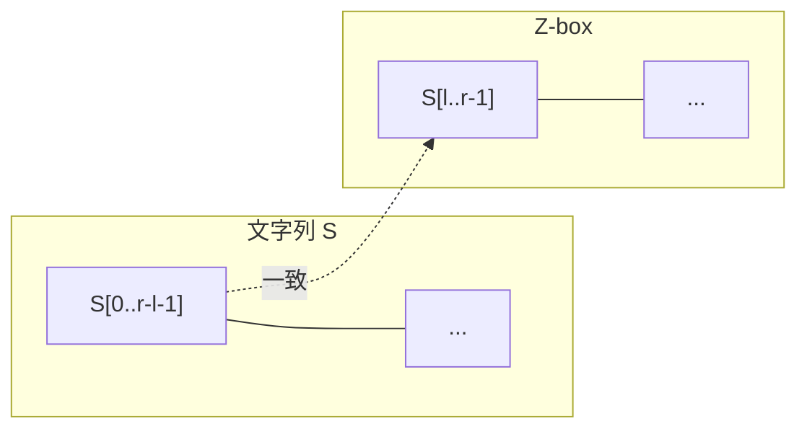
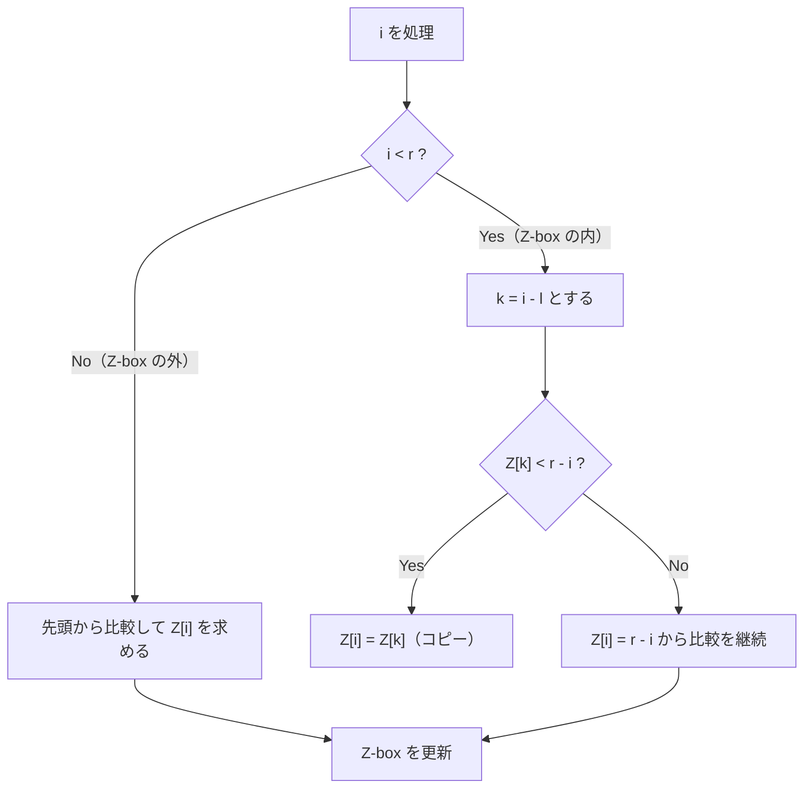

## Z-Algorithm とは

Z-Algorithm は、文字列 $S$ の各位置 $i$ について、$S$ と $S[i:]$ （位置 $i$ から始まる接尾辞）の**最長共通接頭辞 (Longest Common Prefix)** の長さを $O(n)$ で計算するアルゴリズムである。

この結果を格納した配列を **Z配列 (Z-array)** と呼ぶ。

### 定義

長さ $n$ の文字列 $S = s_0 s_1 \cdots s_{n-1}$ に対して、Z配列 $Z[0..n-1]$ を次のように定義する。

$$
Z[i] = \max\{\ k \geq 0 \mid S[0..k-1] = S[i..i+k-1]\ \}
$$

すなわち、$Z[i]$ は位置 $i$ から始まる部分文字列が文字列先頭とどこまで一致するかを表す。慣例として $Z[0] = n$ （文字列全体が自身の接頭辞）とする。

### 具体例

文字列 `aabxaab` の Z配列を求める。

| $i$ | 0 | 1 | 2 | 3 | 4 | 5 | 6 |
|-----|---|---|---|---|---|---|---|
| $S[i]$ | a | a | b | x | a | a | b |
| $Z[i]$ | 7 | 1 | 0 | 0 | 3 | 1 | 0 |

- $Z[1] = 1$: `aabxaab` と `abxaab` は先頭 1 文字 `a` だけ一致
- $Z[4] = 3$: `aabxaab` と `aab` は先頭 3 文字 `aab` が一致
- $Z[3] = 0$: `aabxaab` と `xaab` は先頭で不一致

## 素朴なアプローチ

各位置 $i$ について先頭から 1 文字ずつ比較すれば Z配列を求められる。

```python
def z_array_naive(s: str) -> list[int]:
    n = len(s)
    z = [0] * n
    z[0] = n
    for i in range(1, n):
        while i + z[i] < n and s[z[i]] == s[i + z[i]]:
            z[i] += 1
    return z
```

しかしこの方法は最悪 $O(n^2)$ である。例えば `aaaaaa...` のような文字列では、各位置で $O(n)$ 回の比較が発生する。

## 線形時間アルゴリズム

### 核心アイデア：過去の計算結果の再利用

Z-Algorithm の核心は、**過去に計算した一致区間の情報を再利用する**ことで、不要な比較を省略する点にある。

直感的には、すでに「この範囲は先頭と一致している」とわかっているなら、その範囲内の位置については過去のZ値を流用できる。

### Z-box

アルゴリズムは区間 $[l, r)$ (**Z-box** と呼ぶ) を管理する。これは過去に計算された一致区間のうち、右端 $r$ が最大のものを記録している。

**Z-box の意味:** $S[l..r-1] = S[0..r-l-1]$ が成り立つ。つまり Z-box 内の文字列は、$S$ の先頭部分と完全に一致している。



### アルゴリズムの流れ

各位置 $i = 1, 2, \ldots, n-1$ を処理する。 $l = 0, r = 0$ で初期化する。



### Case 1: $i \geq r$（Z-box の外側）

位置 $i$ が Z-box の外側にある場合、過去の情報は使えない。$S[0]$ と $S[i]$、$S[1]$ と $S[i+1]$、... と 1 文字ずつ比較して $Z[i]$ を求める。

一致した区間が従来の Z-box より右に伸びれば、$l = i$, $r = i + Z[i]$ に更新する。

### Case 2: $i < r$（Z-box の内側）

位置 $i$ が Z-box の内側にある場合がこのアルゴリズムの肝である。

Z-box の性質 $S[l..r-1] = S[0..r-l-1]$ より、位置 $i$ の文字は位置 $k = i - l$ の文字に対応する。つまり $S[i] = S[k]$ である。

この対応関係は位置 $i$ だけでなくその周辺にも成り立つ。そこで既に計算済みの $Z[k]$ を活用する。

#### Case 2a: $Z[k] < r - i$

$Z[k]$ の一致区間が Z-box 内に収まる場合、$Z[i] = Z[k]$ とそのままコピーできる。

**なぜ正しいか：** $Z[k]$ は位置 $k$ から先頭との最長一致の長さである。Z-box の性質から $S[i..i+Z[k]-1] = S[k..k+Z[k]-1] = S[0..Z[k]-1]$ が成り立つ。さらに $Z[k] < r - i$ より $S[i+Z[k]] = S[k+Z[k]] \neq S[Z[k]]$ も成り立つ ($Z[k]$ が最長であることから)。したがって $Z[i] = Z[k]$。

#### Case 2b: $Z[k] \geq r - i$

$Z[k]$ の一致区間が Z-box の境界に達する (または超える) 場合、Z-box 内の情報だけでは $Z[i]$ の正確な値が確定しない。$r - i$ 文字までは一致が保証されるが、$r$ 以降は未確認なので比較を続ける必要がある。

$Z[i]$ を $r - i$ で初期化し、位置 $r$ 以降の文字を先頭の対応する位置と比較して拡張する。

### 実装

```python title="z_algorithm.py"
def z_array(s: str) -> list[int]:
    n = len(s)
    if n == 0:
        return []
    z = [0] * n
    z[0] = n
    l, r = 0, 0
    for i in range(1, n):
        # Case 2: Z-box の内側なら既知の情報を利用
        if i < r:
            z[i] = min(r - i, z[i - l])
        # 先頭と比較して拡張
        while i + z[i] < n and s[z[i]] == s[i + z[i]]:
            z[i] += 1
        # Z-box の更新
        if i + z[i] > r:
            l, r = i, i + z[i]
    return z
```

コードが簡潔なのは、Case 1 と Case 2b を統合しているためである。

- Case 1 ($i \geq r$) では `z[i]` は 0 のまま while ループに入る
- Case 2a ($Z[k] < r - i$) では `z[i] = Z[k]` がセットされ、while ループの条件が即座に偽になる
- Case 2b ($Z[k] \geq r - i$) では `z[i] = r - i` がセットされ、位置 $r$ から比較を継続する

## 計算量の証明

### 命題: Z-Algorithm の時間計算量は $O(n)$

**証明:**

while ループ以外の処理は各 $i$ について $O(1)$ なので、全体で $O(n)$。while ループの総反復回数を評価すれば十分である。

while ループが回るのは以下の 2 つの場合のみ：

1. **Case 1** ($i \geq r$): 比較が成功するたびに $r$ が 1 増加する
2. **Case 2b** ($Z[k] \geq r - i$): 比較が成功するたびに $r$ が 1 増加する

いずれの場合も、while ループ内で比較が成功するたびに $r$ が厳密に増加する。$r$ の初期値は $0$ であり、最大値は $n$ である。$r$ は減少しない (アルゴリズム中で $r$ が減る操作はない)。

したがって、while ループの比較が**成功する**回数の合計は高々 $n$ 回である。

比較が**失敗する**回数は各 $i$ につき高々 1 回なので、合計 $O(n)$ 回。

以上より、全体の比較回数は $O(n)$ であり、アルゴリズムの時間計算量は $O(n)$ である。 $\square$

## 応用：パターンマッチング

Z-Algorithm の代表的な応用は文字列検索である。テキスト $T$ からパターン $P$ の出現位置を全て見つけたい場合、$P$ と $T$ を区切り文字で連結した文字列に Z-Algorithm を適用する。区切り文字を $\diamond$ とすると、

$$
S = P \cdot \diamond \cdot T
$$

$Z[i] = |P|$ となる位置 $i$ が、$T$ 中の $P$ の出現位置に対応する。$T$ 中の位置は $i - |P| - 1$ である。

```python title="pattern_match.py"
def find_pattern(text: str, pattern: str) -> list[int]:
    s = pattern + "#" + text
    z = z_array(s)
    m = len(pattern)
    return [i - m - 1 for i in range(m + 1, len(s)) if z[i] == m]
```

この方法は前処理 $O(|P| + |T|)$、検索 $O(|P| + |T|)$ で動作し、KMP 法と同じ計算量クラスに属する。

## まとめ

| 項目 | 内容 |
|------|------|
| 入力 | 長さ $n$ の文字列 $S$ |
| 出力 | Z配列 $Z[0..n-1]$ |
| 時間計算量 | $O(n)$ |
| 空間計算量 | $O(n)$ |
| 核心 | Z-box による過去の一致情報の再利用 |
| 応用 | パターンマッチング、文字列周期の検出 など |
